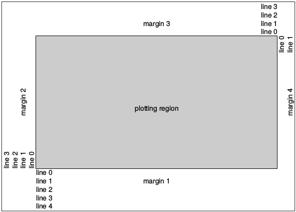
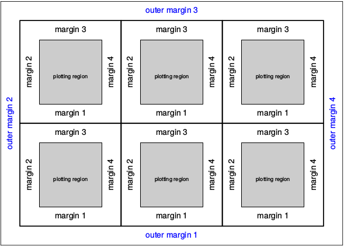
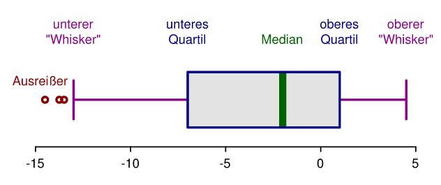

```{r setup, child=here::here("setup.Rmd")}
```

\newpage

# R und RStudio

## Installation von R und RStudio

Als ersten Schritt müssen Sie R und RStudio installieren. Dabei ist wichtig zu
unterscheiden, dass R und RStudio zwei unterschiedliche Programme sind. R ist die
eigentliche Programmiersprache mit der wir arbeiten. 
RStudio hingegen ist eine sogenannte Entwicklungsumgebung ^[Oder auch 
IDE (=Integrated Development Environment) genannt.], die das Arbeiten mit 
R vereinfachen soll.

Sie können also mit R arbeiten ohne RStudio (was unüblich ist), aber nicht mit 
RStudio ohne R.

Gehen Sie für die Installation von R, auf die Website https://cloud.r-project.org/ und laden Sie die für ihren Computer passende R-Version herunter und folgen Sie den Installationsanweisungen. In Linux können Sie R über die Kommandozeile installieren.

Für die Installation von RStudio  gehen Sie zu der Website https://posit.co/download/rstudio-desktop/#download und laden die richtige Version für Ihr Betriebssystem herunter und folgen Sie den Installationsanweisungen.

## Erste Schritte in R

RStudio bietet eine Vielzahl von Funktionen, die uns das Arbeiten mit R erleichtern können. Öffnen Sie RStudio. Sie erhalten eine leere Entwicklungsumgebung. Als erstes bietet es sich an, ein neues Skript zu erstellen. Gehen Sie dafür auf das Menü: \menu{File > New File > R Script} oder klicken Sie die Tastenkombination *Strg + Umschalt + N* (\keys{Strg + \shift + N}). 

```{r rstudio, out.width= "14cm", fig.align='center', fig.cap="RStudio Panes.", echo = FALSE}
knitr::include_graphics(here("img/rstudio.png"))

```


RStudio besteht nun aus vier sogenannten **Panes** oder Ausschnitten (siehe auch Abbildung \@ref(fig:rstudio)). Die Ausschnitte sind wie folgt gegliedert: 

1. Hier werden Skripte anzeigt, d.h., hier wird meist R Code geschrieben und dokumentiert. Der Code wird beim Schreiben noch nicht ausgeführt (siehe Punkt 3), dennoch sollten Sie Code immer so schreiben, dass er Zeile für Zeile abgeschickt werden kann. Sie sollten nie Code schreiben, bei dem Sie zwischen den Zeilen hin und her springen müssen.
2. Der zweite Ausschnitt erteilt Auskunft über den *Workspace*. Im Workspace werden alle verfügbaren Objekte angezeigt. 
3. Die eigentliche R-Konsole wird in Ausschnitt 3 dargestellt. Hier wird in der Regel wenig Code eingegeben. Der normale Workflow ist vom Skript Code an die Konsole zu schicken. Erst durch das Abschicken in die Konsole wird der Code (bzw. die Teile des Codes, die Sie abschicken) ausgeführt.
4. Der vierte Ausschnitt enthält mehrere Reiter. Der Reiter *Files* zeigt den Verzeichnisbaum an. Im Reiter *Plots* werden Plots angezeigt, wenn diese im Code aufgerufen werden. Hilfeseiten zu Funktionen werden im Reiter *Help* angezeigt.

Einfache Rechenoperationen können auch direkt in der R-Konsole durchgeführt werden. Prinzipiell könnten Sie alle Operationen direkt in die Konsole tippen. Der Nachteil und der Grund, warum dies keine gute Praxis ist, ist, dass der Code zwar ausgeführt jedoch nicht gespeichert wird. Code der nicht als Skript gespeichert wird, ist also nicht dokumentiert. Tippen Sie die folgenden Operationen in die Konsole.

```{r}
10 + 5
20 - 10
10 * 3
100 / 19
```

Sie sehen Ihren Code in rot und das Ergebnis dieser Operation in weiß darunter. Die Zahl in `[]` gibt die Dimension des Ergebnisses an. Hier also `[1]` für eine Angabe. Dieses Skript wurde in R Markdown geschrieben (siehe Vorwort). R Markdown verbindet Text und Code. Die Ergebnisse des Codes werden unter dem grau hinterlegten *Codechunk* dargestellt. Darstellung und Farbe des Codes und der Ergebnisse sind jedoch nicht immer exakt so wie sie es in der R Konsole wären.

Weitere häufig verwendete Operationen sind `^` für eine beliebige Potenz, z.B. $2^3$ = `2^3` = `r 2^3`. Analog dazu gibt es die Funktion `sqrt()` zum berechnen von Wurzeln und viele weitere Funktionen. Wenn Sie einen code abschicken, der nicht funktioniertm bekommen Sie statt des Ergebnisses eine Fehlermeldung, welche bestenfalls einen Hinweis zur Korrektur enthält.

Meist verwenden wir jedoch **Skripte**, um den R-Code zu schreiben und ihn dann an die Konsole "zu schicken". Dies hat den Vorteil, dass alle Schritte nachvollziehbar bleiben und Analysen beliebig oft wiederholt werden können. Nach der Ausführung bleibt der Code erhalten und Sie dokumentieren Ihre Berechnungen automatisch mit. Stellen Sie sich den Code im R-Skript wie ein Kochbuch vor. Wenn wir R-Code in einem R-Skript geschrieben haben gibt es mehrere Möglichkeiten diesen Code abzuschicken/ auszuführen. Wir können eine Zeile abschicken, indem wir entweder auf *Run* klicken (Abbildung \@ref(fig:rstudio-run)) oder die Tastenkombination *Strg + Enter* (\keys{Strg + \return}) tippen. Mehrere Zeilen abzuschicken und nacheinander ausführen zu lassen ist möglich, indem diese Zeilen markiert werden bevor Sie *Run* klicken oder die Tastenkombination tippen. Ein Klick auf *Source* bzw. die Tastenkombination *Strg + Umschalt + Enter* (\keys{Strg + \shift + \return}).

```{r rstudio-run, fig.align='center', fig.cap="Zeilenweises Ausführen von Code in RStudio.", echo = FALSE}
knitr::include_graphics(here("img/rstudio_run.png"))

```

Wenn Sie die Codezeile abgeschickt haben, sehen Sie diese Zeile in der Konsole und direkt darunter das Ergebnis sowie die Dimension des Ergebnisses, also genauso, als hätten Sie den Code direkt in die Konsole getippt. Die Konsole erkennt, wenn Sie einen unvollständigen Code abschicken. In der Konsole sehen Sie in diesem Fall kein Ergebnis, sondern ein `+` unter der abgeschickten Zeile. Sie können nun eine weitere Zeile zur vervollständigung abschicken oder in der Konsole *Escape* (\keys{Esc}) drücken, um abzubrechen.


## Gute Praxis bei der Programmierung

Es gibt eine gute Praxis, wie der Stil der Codes sein sollte. Die sog. *Style Guides* sind eine Art generelle Vereinbarung bei der Programmierung. Style Guides sind selbstverständlich optional und wer viel programmiert, wird mit der Zeit evtl. einen eigenen Stil entwickeln. Dennoch bieten Style Guides gerade beim Einstieg in die Programmierung eine gute Orientierungshilfe und erleichtern vor allem das Arbeiten im Team. Der wichtigste und umfangreichste Style Guide für R ist  https://style.tidyverse.org/index.html. Wir empfehlen, die Kapitel `Welcome`, `Files` und  `Syntax` zu lesen, bevor Sie mit dem Programmieren beginnen. Ein weiterer berühmter Syle Guide ist von Google https://google.github.io/styleguide/.

Vielleicht die wichtigste Praxis beim Programmieren ist das Kommentieren. **Kommentare** sind ein wichtiger Bestandteil der Skripte in R und allen anderen Skript- und Programmiersprachen. Sie werden lernen, dass die Kommentarfunktion ein wesentlicher Vorteil gegenüber Klickprogrammen darstellt. Ein Kommentar ist Text in einem (R-)Code, der der Dokumentation dient und von der R Konsole ignoriert wird. Sämtliche Zeilen, die mit dem Zeichen `#` beginnen, werden nicht ausgeführt, wenn Sie an die Konsole gesendet werden. Seien Sie nicht sparsam mit Kommentaren, sondern benutzen Sie sie um Ihren Code zu strukturieren, ihre Berechnungen zu für sich selbst und andere zu erläutern und, um Ergebnisse zu beschreiben oder zu interpretieren.

```{r}
# sqrt(a)
# Berechnen der Quadratwurzel
sqrt(81)
```

Sie können Kommentare auch verwenden, um Code, den sie später vielleicht wieder aktivieren wollen, auszukommentieren. Im vorherigen Codeblock wurde der Funktionsaufruf `sqrt(a)` auskommentiert. Die Zeile `# Berechnen der Quadratwurzel` wird bei der Ausführung ebenfalls ignoriert. Es empfiehlt sich, komplexere Abläufe zu kommentieren, damit andere im Team verstehen, warum und wie etwas gemacht wurde. Ganz besonders gilt das jedoch für einen selbst. Oft sind in der Zukunft Zusammenhänge nicht mehr so klar, wie sie beim Schreiben des Codes waren.

#### `r exercise("Ausführen von Quellcodes")`

Öffnen Sie RStudio, erstellen Sie ein neues Skript und speichern Sie dieses unter dem Namen `skript1.R` ab. 

Tippen oder kopieren Sie folgenden Code in das Skript:

```{r, eval = params$inc_sol}
# Einfache Rechenoperationen
1 + 3
2^7

# Einfache Funktion
sqrt(20)
```

Führen Sie nun alle Zeilen aus.

\newpage

# Variablen, Funktionen und Datentypen


## Variablen beim Programmieren

Ergebnisse aus Berechnungen (wie oben angeführt), aber auch z. B. aus komplexeren Operationen, werden in Variablen abgespeichert. Man kann sich eine Variable wie eine Hülle (oder bildlich gesprochen wie eine Schachtel) vorstellen, in die man etwas hinein legen kann und darauf zu einem späteren Zeitpunkt wieder zugreifen kann. Z. B. weist der folgende Ausdruck der Variable `alter` den Wert `102` zu.

```{r}
alter <- 102
```

Variablen können Objekte in R speichern. Ein Objekt, im einfachsten Fall ein
einzelner Wert, kann mit der Anweisung `<-` einer Variablen zugewiesen werden.
Der nachfolgende Code weist der Variable `a` den Wert 10 zu.

```{r}
a <- 10
a
```

Man kann mit `=` oder `<-` einer Variable einen Wert zuweisen. Der Unterschied ist in den meisten Fällen vernachlässigbar, es wird aber allgemein empfohlen `<-` (`=` ist schlechter Stil) zu verwenden.

Wir können beliebige Variablen erstellen, z.B.

```{r}
abc <- 10
name <- "Johannes"
```


Variablennamen dürfen nicht mit einer Zahl beginnen und müssen aus einem Wort bestehen. Die Variablen erscheinen nach der Definition im *Environment* Zab in Pane 2.

- `a_123 <- 10` ist ok
- `123_a <- 10` erzeugt einen Fehler

Vorsicht: Groß- und Kleinschreibung muss beachtet werden.

```{r}
name <- "Johannes"
name
```

Das Aufrufen der Variable

```{r, eval = FALSE}
Name
```

führt zu einem Fehler.

Wir können dann mit den Werten, die in Variablen gespeichert sind, ganz
normale Rechenoperationen durchführen.

```{r}
a <- 10
b <- 5

a + b
b / a
a^b
```

Das Ergebnis kann natürlich wieder in einer neuen Variable gespeichert werden.

```{r}
ergebnis <- a + b
ergebnis

ergebnis2 <- ergebnis * 2
ergebnis2
```

Mit der Funktion `rm()` können Variablen, können nicht mehr benötigte Variablen, wieder gelöscht werden. Alternativ können Variablen auch überschrieben werden. Es gibt keine Möglichkeit gelöschte oder überschriebene Variablen wiederherzustellen. Sie müssen ggf. neu berechnet werden.

```{r}
var1 <- "irgendwas"
exists("var1") # TRUE. also ja, eine Variable mit diesem Namen existiert
rm(var1)  
exists("var1") # FALSE, also nein, eine Variable mit diesem Namen existiert nicht.
```


## Datentypen

<!-- Johannes, ich glaube, in diesem Absatz wurden Variablen und Objekte vertauscht. Kannst du Mal prüfen, ob das stimmt was ich geschrieben hab? -->
Es wurde bereits erwähnt, dass Daten in Variablen gespeichert werden können. Die Variablen, in denen die Daten (oder auch Berechnungen oder ganze Funktionen) gespreichert werden, heißen in R Objekte. Wenn Sie beispielsweise Messwerte einer Fotofalle speichern möchten, dann hat diese Fotofalle einen Namen (z.B. `Kamera1`) und nach einiger Zeit im Wald wurden hoffentlich auch einige Fotos aufgenommen. Wir nehmen einmal an, dass nach drei Wochen 132 Fotos von Rehen gemacht wurden.

Wir können jetzt sowohl den Namen der Fotofalle, als auch die Anzahl Fotos die aufgenommen wurden, in zwei Variablen abspeichern.

```{r}
kamera_name <- "Kamera_1"
anzahl_rehe <- 132
```

In den zwei vorherigen Zeilen Code haben wir zwei Objekte (im Sinne von R) erstellt. Das erste Objekt heißt `kamera_name` und das zweite Objekt heißt `anzahl_rehe`. In dem Beipiel handelt es sich also um zwei sehr einfache Objekte, in denen jeweils ein Wert gespeichert ist. Auffällig ist, dass beide Objekte unterschiedliche Datentypen haben. `kamera_name`  ist vom Typ `character` (also Text). Das zweite Objekt, `anzahl_rehe`, ist vom Typ `numeric` (also eine Zahl, wir unterscheiden hier nicht weiter^[Für Interessierte, man unterscheidet weiter zwischen Ganzzahlen (`int`) und Gleitkommazahlen (`double`) unterscheiden.]). Zusätzlich zu diesen zwei Typen (`character` und `numeric`), gibt es noch einen weiteren wichtigen Typ: nämlich das logische Wahr oder Falsch (in R: `TRUE` und `FALSE`) und noch weitere Datentypne auf die wir zunächst nicht eingehen (tippen Sie `?typeof` für eine Übersicht aller Datentypen). Zurückkommend auf das Beispiel mit den Fotofallen, könnte eine mögliche Fragestellung sein, ob auf einem der Fotos ein Fuchs gesehen wurde oder nicht. Dazu würden wir eine neue Variable `fuchs_gesehen` anlegen und diese auf `TRUE` setzen, da ein Fuchs gesehen wurde.

```{r}
fuchs_gesehen <- TRUE
```

Wenn Sie sich nicht sicher, um welchen Typen es sich handelt, können sie ihn mit `str` abfragen.
```{r}
typeof(fuchs_gesehen)
```


## Funktionen

Ein zweiter wesentlicher Bestandteil beim Arbeiten mit R sind Funktionen. Während eine Variable etwas *speichert*, *tut* eine Funktion etwas. Beispielsweise zieht die Funktion `sqrt()` die Quadratwurzel aus einer Zahl.

```{r}
sqrt(a)
```

Funktionen sind in R in der Regel daran zu erkennen, dass sie immer mit dem Funktionsnamen, gefolgt von 
runden Klammern (`()`), aufgerufen werden. Der große Umfang an Funktionen für die statistische Datenanalyse und wissenschaftliche Datenverarbeitung ist der Hauptgrung für den Erfolg von R in der Wissenschaft. Im vorherigen Beispiel wurde die Funkion mit dem Namen `sqrt()` aufgerufen. Das Objekt `a` haben wir bereits vorhin definiert (zur Erinnerung `a <- 10`). Die Funktion `sqrt()` arbeitet jetzt mit dem Objekt `a`, das in diesem Zusammenhang auch **Argument** genannt wird. Argumente sind die Objekte, die eine Funktion als Inpout benötigt. Die Hilfeseite jeder Funktion enthält eine Liste aller Argumente. Argumente von Funktionen haben Namen, diese müssen jedoch nicht angegeben werden, wenn die Reihenfolge der Argumente, wie in der Hilfeseite angegeben, berücksichtigt wird. Im vorherigen Beispiel, haben wir die Funktion `sqrt(a)` aufgerufen und keinen Argumentnamen angegeben. Aus den Hilfeseiten für die Funktion `sqrt()` (siehe auch nachfolgender Abschnitt) ist zu entnehmen, dass die Funktion `sqrt()` nur ein Argument mit dem Namen `x` hat. Das heißt, der vollständige Aufruf der Funktion `x` wäre.

```{r}
sqrt(x = a)
```

Um mehr über eine Funktion zu erfahren (z. B. die Bedeutung von Argumenten zu verstehen oder herauszufinden, was eine Funktion zurück gibt), können wir die Hilfeseiten konsultieren. Es gibt unterschiedliche Wege, um zu einer Hilfeseite zu gelangen. 

1. In die Konsole `?<Name der Funktion>` tippen. Also, wenn wir Hilfe für die Funktion `mean()` möchten, könnten wir einfach `?mean` in die Konsole tippen.
2. Analog zu 1), können wir mit der Funktion `help` die Hilfeseite für eine andere Funktion aufrufen (z.B. wenn wir wieder die Hilfe für die Funktion `mean()` lesen möchten, dann könnten wir auch `help(mean)` in die Konsole tippen).
3. In RStudio kann man auch auf das `Help`-Panel klicken und dann einfach eine Funktion suchen (siehe Abbildung 1). 
4. Wenn der Cursor in RStudio auf einer Funktion ist, kann man mit der Taste F1 die dazugehörige Hilfeseite aufrufen.


## Datenstrukturen

```{r, echo = FALSE, results="asis"}
set.seed(123)
npics <- c(132, round(runif(14, 50, 150)))
```

Verfolgen wir das Beispiel mit den Fotofallen etwas weiter. Es handelt sich um ein systematisches Monitoring. D. h., es wurde nicht nur eine Fotofalle ausgebracht, sondern insgesamt 15 Stück. Dieser Umstand erfordert komplexere Objekte. Nachfolgend sind die Anzahl Rehfotos für jede der 15 Fotofallen aufgeführt: `r npics`.

Die Frage, die sich jetzt stellt, ist: Wie kann man diese Daten sinnvoll organisieren? Zusätzlich zur Anzahl der fotografierten Rehe soll jede Fotofalle eine eindeutige ID haben (`Kamera_1`, ..., `Kamera 15`) und wir wissen, dass jeweils 5 Fotofallen in drei unterschiedlichen Revieren aufgestellt waren (Fotofalle 1 bis 5 in Revier A, Fotofalle 6 bis 10 in Revier B und Fotofalle 11 bis 15 in Revier C).

Ein erster, wenn auch nicht wirklich sinnvoller, Ansatz könnte sein, dass wir für jede Fotofalle drei Objekte erstellen:

```{r}
# 1. Kamera
name1 <- "Kamera_1"
anzahl_rehe1 <- 132
revier_1 <- "Revier A"

# 2. Kamera
name2 <- "Kamera_2"
anzahl_rehe2 <- 79
revier_2 <- "Revier A"

# usw.
```

Wenn wir so vorgehen würden, hätten wir 45 Objekte. Dieser Ansatz ist nicht sehr effizient und führt schnell zu einem unübersichtlichen *Workspace*^[Als *Workspace* werden alle Objekte bezeichnet, die in einer R-Session zur Verfügung stehen.]. Wir werden im Verlauf unterschiedliche Datenstrukturen kennenlernen.

#### `r exercise("Variabeln")`

Verwenden Sie die folgenden Daten

```{r}
a <- 2
b <- "100"
p <- FALSE
```

und berechnen sie:

-   `10 * a`
-   `a / 144` und speichern Sie das Ergebnis in einer neuen Variablen
    `e` zwischen.
-   Was ist das Ergebnis von `a + b`?
-   Was ist das Ergebnis von `a + p`?

```{r, eval=params$inc_sol, error=params$inc_sol}
10 * a
e <- a / 144
a + b
a + p
```

## Funktionen

Ein zweiter wesentlicher Bestandteil beim Arbeiten mit R sind Funktionen. Während eine Variable etwas *speichert* *tut* eine Funktion etwas. Beispielsweise zieht die Funktion `sqrt()` die Quadratwurzel aus einer Zahl.

```{r}
sqrt(a)
```

Funktionen sind in R in der Regel daran zu erkennen, dass sie immer mit dem Funktionsnamen, gefolgt von 
runden Klammern (`()`), aufgerufen werden. Im vorherigen Beispiel wurde die Funkion mit dem Namen `sqrt()` aufgerufen. Das Objekt `a` haben wir bereits vorhin definiert (zur Erinnerung `a <- 10`). Die Funktion `sqrt()` arbeitet jetzt mit dem Objekt `a`, das in diesem Zusammenhang auch **Argument** genannt wird. 

Argumente von Funktionen haben Namen, diese müssen jedoch nicht angegeben werden, wenn die Reihenfolge der Argumente berücksichtigt wird. Im vorherigen Beispiel, haben wir einfach die Funktion `sqrt(a)` aufgerufen und keinen Argumentnamen angegeben. Aus den Hilfeseiten für die Funktion `sqrt()` (siehe auch nachfolgender Abschnitt) ist zu entnehmen, dass die Funktion `sqrt()`  ein Argument mit dem Namen `x` hat. Das heißt, der vollständige Aufruf der Funktion `x` wäre.

```{r}
sqrt(x = a)
```

Um mehr über eine Funktion zu erfahren (z.B. die Bedeutung von Argumenten zu verstehen oder herauszufinden, was eine Funktion zurück gibt), können wir die Hilfeseiten konsultieren. Es gibt unterschiedliche Wege, um zu einer Hilfeseite zu gelangen. 

1. In die Konsole `?<Name der Funktion>` tippen. Also, wenn wir Hilfe für die Funktion `mean()` möchten, könnten wir einfach `?mean` in die Konsole tippen.
2. Analog zu 1), können wir mit der Funktion `help` die Hilfeseite für eine andere Funktion aufrufen (z.B. wenn wir wieder die Hilfe für die Funktion `mean()` lesen möchten, dann könnten wir auch `help(mean)` in die Konsole tippen).
3. In RStudio kann man auch auf das `Help`-Panel klicken und dann einfach eine Funktion suchen (siehe Abbildung 1). 
4. Wenn der Cursor in RStudio auf einer Funktion ist, kann man mit der Taste F1 die dazugehörige Hilfeseite aufrufen.


\newpage

# Vektoren

Die gute Nachricht zuerst, Sie haben bereits Vektoren erstellt in R (und dies wahrscheinlich nicht bewusst wahrgenommen). Wenn Sie nämlich eine Variable erstellen (z.B., `a <- 10`), wird ein Vektor der Länge eins erstellt, das heißt der Vektor enthält genau ein Element. 

```{r fig1, out.width = "350px", echo = FALSE, fig.cap="Schematische Darstellung eines Vektors in R.", fig.align="center"}
include_graphics(here("img/vectors.jpg"))
```


 Sie können sich Vektoren wie einen Schubladenschrank vorstellen (siehe auch Abbildung \@ref(fig:fig1)). Wichtig ist dabei, dass man in jede Schublade immer nur ein Element vom gleichen Typ verstauen kann. Etwas allgemeiner gesprochen heißt das, dass alle Elemente eines Vektors vom gleichen Datentyp sein müssen. 
 
Es gibt zahlreiche Funktionen zum Erstellen von Vektoren (einige davon werden wir im weiteren Verlauf des Moduls kennenlernen). Die wohl wichtigste Funktion ist `c()`. Dabei steht `c` für *combine* oder *concatenate*. Die Funktion `c()` fügt einzelne Elemente in einen Vektor zusammen (und zwar genau in der Reihenfolge wie diese Elemente an `c()` übergeben werden). 
 
Gehen wir nochmals zurück zu Abbildung \@ref(fig:fig1), da wird schematisch dargestellt wie ein Vektor `s` mit 7 Elementen (in diesem Fall Zahlen) erstellt werden kann.

```{r}
s <- c(37, 1, 15, 2, 7, 19, 22)
```

Die Funktion `c()` ordnet jetzt bildlich gesprochen die Zahl 37 der ersten Schublade zu, die Zahl 1 der zweiten Schublade und so weiter. Wenn Sie jetzt einfach `s` in die Konsole tippen, können Sie alle Elemente von `s` sehen:

```{r}
s
```

In Abbildung \@ref(fig:fig1)b wird der Vektor `s` nochmals systematisch dargestellt. Dabei sieht man, dass `37` an der ersten Position des Vektors gespeichert wird und `22` an der letzten Position des Vektors gespeichert wird.


Die Grundrechenarten (`+`, `-`, `/`, `*`) und viele andere Funktionen funktionieren genau gleich mit Vektoren deren Länge > 1 ist. Sie werden elementweise durchgeführt. Wir können beispielsweise zu jedem Element von `s` 10 addieren

```{r}
s + 10
```

oder `s` mit sich selbst multiplizieren.

```{r}
s * s
```

Neben der Funktion `c()` gibt es zahlreiche weitere Funktionen, um Vektoren zu erstellen. Sehr häufig braucht man Vektoren von Zahlenfolgen, solche Vektoren können mit der Funktion `seq` erstellt werden. Im einfachsten Fall benötigt `seq()` zwei Argumente: `from` und `to`^[Weil solche Vektoren so häufig vorkommen gibt es hier eine Abkürzung. Man kann `seq(from, to, by = 1)` mit `from:to` abkürzen. Also `1:10` würde auch alle Zahlen von 1 bis 10 zurückgeben.].

```{r}
seq(from = 1, to = 10)
```

Man kann dann auch noch die Schritte angeben, mit denen erhöht wird. 

```{r}
seq(from = 1, to = 10, by = 2)
```


#### `r exercise("Vektoren erstellen")`

Sie haben den BHD (Brusthöhendurchmesser) in cm von vier Bäumen gemessen: `13, 15.3, 23, 9`

-   Erstellen Sie einen Vektor mit dem Namen `bhd` in dem Sie die Werte
    speichern
-   Transformieren sie die BHD-Werte in mm.
-   Berechnen Sie die Fläche des BHD in $cm^2$ (nehmen Sie dafür an, dass ein Baum
    kreisrund ist).

```{r, include=params$inc_sol}
bhd <- c(13, 15.3, 23, 9)
bhd_mm <- bhd * 10
(bhd / 2 )^2 * pi

```

   
## Funktionen zum Arbeiten mit Vektoren

Die Funktionen `head()` und `tail()` geben die ersten bzw. letzten `n` Elemente eines Vektors zurück. `n` hat einen voreingestellten Wert von 6, dieser kann natürlich angepasst werden.

```{r}
head(s)
head(s, n = 3)
tail(s, n = 2)
```


Die Funktion `length()` gibt die Länge eines Vektors wieder.

```{r}
length(s)
```

Der Typ der Elemente eines Vektors kann mit der Funktion `class` abgefragt werden: 

```{r}
class(s)
```

Die eindeutigen Elemente eines Vektors können mit der Funktion `unique()` abgefragt werden.
```{r}
unique(s)
```

Mit der Funktion `table` kann die Häufigkeit verschiedener Elemente abgefragt werden.

```{r}
table(s)
```


Schlussendlich kann man mit der Funktion `sort()` und `rev()` die Position von Elementen in einem Vektor ändern. Die Funktion `rev` dreht die Elemente einmal um

```{r}
rev(s)
```

während `sort()` einen Vektor nach seinen Elementen sortiert^[Auch für `sort()` gibt es ein zusätzliches Argument, das es ermöglicht die Elemente in absteigender Reihenfolge zu sortieren. Schauen Sie sich dazu, und auch für weitere Funktionen, die Hilfeseiten an.].

```{r}
sort(s)
```

Die Funktion `rep()` wiederholt einen Vektor. 

```{r}
rep(s, times = 2)
```

Anstelle des Arguments `times` kann auch das Argument `each` verwendet werden. Der Unterschied liegt darin, dass `times` den gesamten Vektor `times`-Mal wiederholt und `each` jedes Element. 

```{r}
a <- 1:4
rep(a, times = 2)
rep(a, each = 2)
```


#### `r exercise("Arbeiten mit Vektoren")`

Es liegen jeweils zwei BHD-Messungen von vier Bäumen vor:

```{r}
bhd <- c(32, 33, 23, 21, 21, 27, 18, 12)
```

Diese wurden immer abwechselnd mit zwei unterschiedlichen Messgeräten durchgeführt wurden. 

Erstellen Sie einen Vektor von der Länge 8 mit den Einträgen die immer abwechselnd `G1` und `G2` sind und für die zwei Geräte stehen. 
```{r, include=params$inc_sol}
bhd <- c(32, 33, 23, 21, 21, 27, 18, 12)
rep(c("G1", "G2"), 4)
```


## Statistische Funktionen

Zahlreiche statistische Funktionen können auf Vektoren angewendet werden, hier sind nur die wichtigsten aufgeführt: `mean()` berechnet den Mittelwert, `median()` berechnet den Median und `sd()` die Standardabweichung.

```{r}
mean(s)
median(s)
sd(s)
```

Eine weitere sehr häufig verwendete Funktion ist `sample()`. Mit `sample()` werden `size` Elemente zufällig aus einem Vektor, mit oder ohne Zurücklegen (mit Zurücklegen wird gezogen, wenn das Argument `replace = TRUE` gesetzt wird), gezogen.

```{r}
sample(s, size = 1) # 1 Element
sample(s, size = 3) # 2 Elemente
```
Wenn `size` weg gelassen wird, dann bekommt man gleich viele Elemente zurück (wie der Vektor lang ist), d.h. der Vektor wird nur permutiert. 


## Beispiel Fotofallen

Für den weiteren Verlauf wollen wir noch einmal zu dem Beispiel mit den Fotofallen zurückkommen. Wir können jetzt 3 Vektoren erstellen, jeweils einen für die ID, die Anzahl Rehfotos und das Revier. Dabei werden zwei weitere Funktionen eingeführt (`paste` und `rep`). 

Als erstes erstellen wir einen Vektor mit den Anzahlen Rehfotos. Das geht einfach mit `c()`:

```{r}
anzahl_rehe <- c(132, 79, 129, 91, 138, 144, 55, 103, 139, 
                 105, 96, 146, 95, 118, 1007)
```


Als zweites erstellen wir einen Vektor mit den IDs. Zur Erinnerung, diese sollten die Werte `Kamera_1` bis `Kamera_15` haben. Ein erster Ansatz könnte sein, dass wir einfach 15 Fotofallen schreiben und dann die Zahlen 1 bis 15 dahinter.

```{r}
ids <- c("Kamera_1", "Kamera_2", "Kamera_3", "Kamera_4", "Kamera_5", 
         "Kamera_6", "Kamera_7", "Kamera_8", "Kamera_9", "Kamera_10", 
         "Kamera_11", "Kamera_12", "Kamera_13", "Kamera_14", "Kamera_15"
)
```
Dieser Ansatz ist unbefriedigend, da wir 15 mal das Wort "Kamera" tippen müssen. Wir können das Problem in zwei kleinere Probleme zerlegen: 1) 15 mal das Wort Kamera erstellen und die Zahlen 1 bis 15 erstellen, 2) die zwei Vektoren aus 1) "zusammenkleben".

Ein Vektor kann mit der Funktion `rep` wiederholt werden, das heißt wir können ganz einfach 15 mal das Wort "Kamera" erstellen und speichern das Zwischenergebnis in einem Vektor `v1`.

```{r}
v1 <- rep("Kamera", 15)
```

Im nächsten Schritt müssen wir die Zahlen 1 bis 15 erstellen, auch dieses Zwischenergebnis speichern wir in einem neuen Vektor `v2`.

```{r}
v2 <- 1:15
```

Jetzt müssen wir lediglich die Vektoren `v1` und `v2` "zusammenkleben". Dafür gibt es die Funktion `paste`, die zwei Vektoren elementweise verbindet, dabei wird das Argument `sep` als Trennzeichen verwendet. In unserem Fall wäre das also.

```{r}
ids <- paste(v1, v2, sep = "_")
ids
```


Dann fehlt jetzt lediglich der Vektor mit den Revieren. Hier könnten wir erneut auf die Funktion `rep` zurückgreifen.

```{r}
rep(c("Revier A", "Revier B", "Revier C"), 5)
```

Das Ergebnis stimmt noch nicht ganz, da wir 5 mal `Revier A` usw. brauchen. Mit dem zusätzlichen Argument `each = 5` können wir genau zu diesem Ergebnis kommen.


```{r}
reviere <- rep(c("Revier A", "Revier B", "Revier C"), each = 5)
reviere

```


#### `r exercise("Statistische Funktionen")`

1. Berechnen Sie den Mittelwert und Median für die Anzahl Fotos.

```{r, include = params$inc_sol}
mean(anzahl_rehe)
median(anzahl_rehe)
```

2. Erstellen Sie die folgende Ausgabe: 

```{r, echo = params$inc_sol}
paste("Die mittlere Anzahl von Rehfotos beträgt", mean(anzahl_rehe), "Rehe pro Standort.")
```


## Arbeiten mit logischen Werten

Weniger bekannt sind die sogenannte booleschen Rechenregeln, also das Rechnen mit wahr (`TRUE`) und falsch (`FALSE`).
Dabei werden die folgenden Operationen am häufigsten verwendet.

- Gleichheit (`==`)
- Ungleichheit (`!=`)
- Größer (`>`) und kleiner (`<`)
- Größer gleich (`>=`) und kleiner gleich (`<=`)

Das Ergebnis von logischen Operatoren ist immer `TRUE` oder `FALSE`. 

Bei Vektoren kommt es immer zu einer elementweisen Anwendung. Wir können beispielsweise abfragen an welchen Fotofallenstandorten mehr als 100 Rehe fotografiert wurden oder

```{r}
anzahl_rehe > 100
```

welche Fotofallenstandorte sich in Revier B befinden.

```{r}
reviere == "Revier B"
```

Des Weiteren können logische Ausdrücke miteinander verknüpft werden. Dies geschieht mit einem logischen Und (`&`) oder einem logischen Oder (`|`). Für das logische Und müssen beide Ausdrücke ein `TRUE` zurückgeben um ein `TRUE` zu erhalten. Für ein logisches Oder reicht es, wenn einer der beiden Ausdrücke `TRUE` zurückgibt, um ein `TRUE` zu erhalten. 

Damit können wir nun z.B. die beiden vorherigen Abfragen verbinden. Die erste Abfrage ist: Hat eine Fotofalle mehr als 100 Rehe fotografiert und stand die Fotofalle in Revier B.

```{r}
anzahl_rehe > 100 & reviere == "Revier B"
```


Das war jetzt eine Abfrage mit einem logischen Und. Würden wir ein logisches Oder verwenden, dann bekommen wir für alle Elemente ein `TRUE`, die entweder in Gebiet B stehen oder mehr als 100 Rehfotos aufgezeichnet haben.


```{r}
anzahl_rehe > 100 | reviere == "Revier B"
```

Das Arbeiten mit logischen Werten kann fürs Erste etwas abstrakt erscheinen, aber wir werden im folgenden Abschnitt (Abschnitt \@ref(zugriff)) zahlreiche Anwendungsbeispiele dafür sehen.

`TRUE` wird intern als `1` gespeichert und `FALSE` als `0`. Es ist möglich mit `TRUE`s und `FALSE`s zu rechnen. 

```{r}
TRUE + TRUE
FALSE + FALSE
TRUE + FALSE
```

#### `r exercise("Arbeiten mit logischen Werten")`

Überlegen Sie für jede Aufgabe erst was das richtige Ergebnis ist und Überprüfen Sie dieses dann mit R.

1. `TRUE | FALSE`
2. `FALSE & TRUE`
3. `(FALSE & TRUE) | TRUE`
4. `(2 != 3) | FALSE`
5. `FALSE + 10`
6. `TRUE + 10`
6. `TRUE + 10 == FALSE + 10`
6. `sum(c(TRUE, TRUE, FALSE, FALSE))`

```{r, include=params$inc_sol}
TRUE | FALSE
FALSE & TRUE
(FALSE & TRUE) | TRUE
(2 != 3) | FALSE
FALSE + 10
TRUE + 10
TRUE + 10 == FALSE + 10
sum(c(TRUE, TRUE, FALSE, FALSE))
```


## Zugreifen auf Elemente eines Vektors (=Untermengen) {#zugriff}

Sehr oft wollen wir auf bestimmte Werte in einer Datenstruktur zugreifen. Beispielsweise könnte es uns interessieren, wieviele Rehe im Mittel auf allen Fotofallen aus Revier A gesehen wurden. 


Bei Vektoren kann auf die einzelnen Elemente mit eckigen Klammern (`[ ]`, diese werden auch Indizierungsklammern genannt) zugegriffen werden. Der Ausdruck `anzahl_rehe[2]` gibt die Anzahl an fotografierten Rehen für die zweite Fotofalle zurück. Es gibt zwei Möglichkeiten, was in die eckigen Klammern geschrieben werden kann: 1) die Positionen der Elemente die man zurückhaben möchte. Ist es mehr als ein Element, dann muss man einfach einen Vektor mit den Positionen übergeben; 2) ein logischer Vektor von der gleichen Länge, es werden alle Elemente zurückgegeben bei denen ein `TRUE` steht.

Abfragen des zweiten Elements in dem Vektor `anzahl_rehe`: 

```{r}
anzahl_rehe[2]
```

Abfragen aller Elemente aus `anzahl_rehe`, die aus dem Revier `A` stammen. 

```{r}
anzahl_rehe[c(1, 2, 3, 4, 5)] 

# oder schneller
anzahl_rehe[1:5]  # da `1:5` einen Vektor mit allen Zahlen von 1 bis 5 erstellt.
```

Hier ist nochmals hervorzuheben, dass innerhalb der eckigen Klammer mit dem Befehl `c(1, 2, 3, 4, 5)` bzw. `1:5` ein Vektor erstellt wird, der die Position der Elemente angibt, die zurückgegeben werden sollen.

#### `r exercise("Zugreifen auf Vektorelemente")`

Erstellen Sie einen neuen Vektor `bhd`

```{r}
bhd <- c(12, 32, 39, 41, 12, 30)
```


- Wählen Sie aus dem Vektor `bhd` nur das 2. und 3. Element aus.
- Wählen Sie aus dem Vektor `bhd` das letzte Element aus.
- Wählen Sie aus dem Vektor `bhd` das letzte Element aus, ohne die Zahl 6 zu schreiben.

```{r, include = params$inc_sol}
bhd[2:3]
# Entweder
bhd[6]
# oder
rev(bhd)[1]
bhd[length(bhd)]
```


-----

Alternativ könnte das gleiche Ergebnis mit einem logischen Vektor erreicht werden. Für eine bessere Übersichtlichkeit wird erst ein Vektor `sub` erstellt, in dem die logischen Werte gespeichert werden:


```{r}
sub <- c(TRUE, TRUE, TRUE, TRUE, TRUE, FALSE, FALSE, FALSE, 
         FALSE, FALSE, FALSE, FALSE, FALSE, FALSE, FALSE)
anzahl_rehe[sub]
```

Das Erstellen des `sub`-Vektors ist mühsam und wenig zielführend. Wenn wir auf die Erkenntnisse aus dem vorherigen Kapitel zurückgreifen, kann dies leicht automatisiert werden, indem wir einfach abfragen, welche Elemente in Revier zu `Revier A` gehören.

```{r}
sub <- reviere == "Revier A"
anzahl_rehe[sub]
```

Das kann nochmals vereinfacht werden, indem wir den Hilfsvektor `sub` einfach weglassen und den Ausdruck direkt in die eckigen Klammern ziehen.

```{r}
anzahl_rehe[reviere == "Revier A"]
```

Wenn wir jetzt noch den Mittelwert der Anzahl fotografierten Rehe aus Revier A bilden möchten, erweitert sich der Ausdruck um einen Funktionsaufruf zur Funktion `mean`.

```{r}
mean(anzahl_rehe[reviere == "Revier A"])
```

#### `r exercise("logische Werte")`

Verwenden Sie nochmals den Vektor mit den Anzahl Rehen die an unterschiedlichen Fotofallenstandorten fotografiert wurden.

```{r}
anzahl_rehe <- c(132, 79, 129, 91, 138, 144, 55, 103, 139, 105, 96, 146, 95,  118, 107)
```

1. Wählen Sie alle Standorte aus für die Aussage zu $90 \le x < 120$ zu trifft (wobei $x$ für die Anzahl Fotos an einem Standort steht).
2. Berechnen Sie die mittlere Anzahl Fotos für alle in 1) ausgewählten Standorte.

```{r, include = params$inc_sol}
anzahl_rehe[anzahl_rehe > 90 & anzahl_rehe < 120]

mean(anzahl_rehe[anzahl_rehe > 90 & anzahl_rehe < 120])
```


## Der `%in%`-Operator

Häufig wollen wir mehrere Elemente aus einem Vektor auswählen, die in
einem anderen Vektor enthalten sind. Als einfaches Beispiel nehmen wir
zwei Vektoren:

```{r}
arten <- c("FI", "BU")
messungen_arten <- c("FI", "BU", "BU", "EI", "EI", "BI", "FI", "BI", "EI")
```

Wenn wir aus dem Vektor `messungen_arten` alle `FI` auswählen wollen, können
wir dies mit einem logischen `==` machen:

```{r}
messungen_arten[messungen_arten == "FI"]

# oder
messungen_arten[messungen_arten == arten[1]]
```

Etwas komplizierter wird es, wenn wir zwei oder mehr Elemente auswählen
wollen. Dies geht auch mit logischen Operationen.

```{r}
messungen_arten[messungen_arten == arten[1] | messungen_arten == arten[2]]
```

Diese Herangehensweise wird aber für $>2$ Elemente in `arten` sehr
mühsam. Eine Alternative bietet der `%in%`-Operator. Dieser testet, ob
Elemente eines Vektors in einem zweiten Vektors enthalten sind.

```{r}
messungen_arten %in% arten
messungen_arten[messungen_arten %in% arten]
```


#### `r exercise("Auswählen von Elementen in einem Vektor (%in%)")`

Der Vector `LETTERS` ist in R vorhanden und enthält die Buchstaben von A bis Z. 

```{r}
LETTERS
```
Wählen Sie aus `LETTERS` nur die Vokale aus.

```{r, include = params$inc_sol}

LETTERS %in% c("A", "E", "I", "O", "U")
LETTERS[LETTERS %in% c("A", "E", "I", "O", "U")]
```


\newpage

# Faktoren (`factors`)

R besitzt einen besonderen Datentyp -- *Faktoren* (engl. factors) -- zum speichern von diskreten Kovariaten (z.B. Baumart, Augenfarbe oder Automarke). Faktoren erlauben es Daten vom Typ `character` effizienter abzuspeichern. Dabei wird jeder eindeutiger Wert (=Level) mit einer Zahl codiert und dann werden nur diese Zahlen zusammen mit einer Tabelle zum Nachschauen der Werte gespeichert [siehe dazu auch @mcnamara2018]. 

Mit der Funktion `factor()` kann ein Faktor erstellt werden. Im einfachsten Fall wird nur ein Vektor übergeben. 

```{r}
a <- c("FI", "BU", "FI", "EI", "EI", "FI", "FI")
factor(a)
```

Ohne weitere Spezifikation werden die Werte *Levels* alphabetisch angeordnet (das kann später z.B. beim Erstellen von Abbildungen wichtig sein), dies kann jedoch durch die Verwendung des Arguments `levels` gesteuert werden. 

```{r}
factor(a, levels = c("FI", "BU", "EI"))
```

Es ist auch möglich die Beschriftung (= labels) der unterschiedlichen Levels anzugeben mit dem Argument `labels`.

```{r}
af <- factor(a, levels = c("FI", "BU", "EI"), 
             labels = c("Fichte", "Buche", "Eiche"))
af
```
Mit der Funktion `levels()` können die unterschiedlichen Levels eines Faktors abgefragt bzw. gesetzt werden. 

```{r}
levels(af)
levels(af) <- c("Fi", "Bu", "Ei")
af
```

Schlussendlich kann man mit der Funktion `relevel()` die Referenzkategorie eines Faktors (der erste Level) angepasst werden. Das ist kann für lineare Modell wichtig sein.

```{r}
af
relevel(af, "Bu")
```

Mit der Funktion `as.character()` kann ein Faktor wieder als Variable vom Typ `character` dargestellt werden. 

```{r}
as.character(af)
```

Achtung mit der Funktion `as.numeric()` erhält man die interne Kodierung von Faktoren. 
```{r}
af
as.numeric(af)
```

Fichte ist das erste Level des Faktors, deshalb erhalten alle Fichteneinträge den Wert 1. Bucheinträge erhalten den Wert 2 und 3 für Eichen.

#### `r exercise("Faktoren")`

Verwenden Sie den Vektor `staedte` und erstellen Sie einen Vektor mit der Anordung der `levels` in umgekehrter alphabetischer Reihenfolge.

```{r}
staedte <- c("Berlin", "Aachen", "Berlin", "Ulm", "Aachen", 
             "Berlin", "Berlin", "Aachen", "Ulm", "Ulm")
```

```{r, include = params$inc_sol}
##### Mögliche Lösung
s1 <- factor(staedte)
s1 # das erste Level ist automatisch Aachen (-> fängt mit A an)

s2 <- factor(staedte, levels = c("Ulm", "Berlin", "Aachen"))
s2

s3 <- factor(staedte, levels = sort(unique(staedte), decreasing = TRUE))
s3

levels(s3) <- c("Ulm (BW)", "Berlin (Berlin)", "Aachen (NRW)")
s3

```


\newpage

# Spezielle Einträge

In vielen Fällen werden spezielle Einträge benötigt, bspw. bei

- fehlenden Einträge `NA`,
- leeren Einträgen `NULL`,
- undefinierten Einträgen `NaN` (Not a Number) oder
- unendlichen Zahlen (`Inf`).

Spezielle Einträge sind reservierte Namen. Sie können nicht überspeichert werden.

## `NA`

R verfügt über einen speziellen Wert für fehlende Einträge. Auch wenn in
Vektoren eigentlich nur ein Datentyp erlaubt ist, sind `NA` zwischen den
anderen Einträgen erlaubt. Der Datentyp des Vektors wird durch NA
Einträge nicht verändert.

```{r na1}
na1 <- c("foo", NA, "foo")
str(na1)
na2 <- c(3, 6, NA)
str(na2)
```

Der logische Opertator zum Test auf fehlende Wert ist `is.na()`. Dieser
kann genauso wie die bereits bekannten logischen Operatoren bspw. zum
Filtern verwendet werden. Die `na.omit()` Funktion entfernt `NA` aus dem
Datensatz.

```{r na2}
is.na(na1)
na.omit(na1)
```

Die bereits bekannten logischen Operationen ergeben `NA`, wenn Sie auf
Daten angewendet werden, die `NA` enthalten. Berechnungen mit
`NA` ergeben ebenfalls `NA`. Bei der angewandten Programmierung müssen
sie also darauf achten, dass Ihre Daten frei von `NA` sind oder sie
fangen die `NA` vorher ab.

```{r na3}
na2 < 3
1 + NA
```

Viele R Funktionen haben eingebaute Methoden zum Umgang mit `NA`. Die
Funktion `mean()` bspw. ergibt (wie die meisten Funktionen)
standardmäßig `NA` wenn sie auf Vektoren mit Datenlücken angewendet
wird, es sei denn man stellt innerhalb der Funktion ein, dass
Datenlücken entfernt werden sollen.

```{r}
mean(na2)
mean(na2, na.rm = TRUE)
```

## `NULL`

Im Gegensatz zu `NA` wird `NULL` für leere Einträge verwendet, und nicht für fehlende Einträge.
Da in der Mathematik leere Einträge und fehlende Einträge unterschiedliche Informationen darstellen, können diese beiden Fälle unterschieden werden.
Mit der Funktion `is.null()` kann man überprüfen, ob ein Element in einem Vektor `NULL` ist oder nicht.

## `Inf`

Die größtmögliche Zahl in R ist `1.7976931 * 10^308`. Größere Zahlen
werden als unendlich gespeichert.

```{r inf1}
10^309
2 * Inf
1 + Inf
3 / 0
-3 / 0
3 / Inf
```

Infinity kann mit `is.infinite` und `is.finite` getestet werden.
Relationäre Operatoren funktionieren erwartungsgemäß.

```{r}
inf1 <- c(Inf, 0, 3, -Inf, 10)
is.infinite(inf1)
is.finite(inf1)
inf1 < 3
```

#### `r exercise("Vektoren mit spezeillen Einträgen")`

Verwenden Sie den Vektor

```{r uebNa1}
foo <- c(13563, -13156, -14319, 16981, 12921, 11979, 9568, 8833, -12968, 8133)
```

-   Nehmen Sie jeden Eintrag hoch 75. Filtern Sie alle unendlichen
    Einträge aus dem Vektor.
-   Wie viele Einträge sind unendlich negativ?

Verwenden Sie den Vektor

```{r uebNa2}
foo <- c(4.3, 2.2, NULL, 2.4, NaN, 3.3, 3.1, NULL, 3.4, NA, Inf)
```

Sind die folgenden Einträge richtig oder falsch? Überlegen Sie zunächst
selbst bevor Sie die Aussagen in R testen.

-   Die Länge des Vektors ist 9.
-   `is.na()` ergibt 2 Mal `TRUE`.
-   `foo[9] + 4 / Inf` ergibt `NA`

Berechnen Sie den arithmetischen Mittelwert von `foo`.

\newpage


# `data.frame`s oder Tabellen

Im vorherigen Teilabschnitt haben wir gesehen, wie mehrere Werte des gleichen Typs in einem Vektor zusammengefasst werden können. Abschließend wurde anhand des Fotofallenbeispiels gezeigt, wie Vektoren eingesetzt werden können. Wir erstellten drei Vektoren, die jeweils die Merkmalsausprägungen eines Merkmals aller Fotofallenstandorte speichern. In statistischer Sprache, sind die Fotofallen die Beobachtungen (oder auch Merkmalsträger genannt) und die Informationen zu den Fotofallen (also ID, Anzahl Rehe und das Revier) die Merkmale. Jeder beobachtete Wert (z.B. die 132 fotografierten Rehe von Kamera 1) ist dann eine Merkmalsausprägung. 

Sie können sich ein `data.frame` wie eine Tabelle aus einem Tabellenkalkulationsprogramm vorstellen. Es gibt Zeilen in denen die Beobachtungen gespeichert sind und Spalten, die die Merkmale speichern. In unserem Fall gäbe es 15 Zeilen (eine Zeile für jede Fotofalle) und drei Spalten (jeweils eine Spalte für ID, Anzahl Rehe und Revier). Der Befehl zum Erstellen eines `data.frame`s in R  ist `data.frame()`. Für unser Beispiel wäre es:

```{r}
monitoring <- data.frame(
   ID = ids, 
   anzahl_rehe = anzahl_rehe, 
   revier = reviere
)
monitoring
```

Im vorhergehenden Codebeispiel wurde ein `data.frame` erstellt und in die Variable `monitoring` gespeichert.
Die Funktion `data.frame()` nimmt als Argumente beliebig viele Paare, die immer aus einem Namen und einem Vektor mit dazugehörigen Werten bestehen. D.h., dass immer eine Spalte vom selben Typ sein muss, es aber für jede Beobachtung (=Zeile) Merkmale von unterschiedlichen Typen geben kann.

## Wichtige Funktionen zum Arbeiten mit `data.frame`s

Wichtige Funktionen um das Arbeiten mit `data.frame`s zu erleichtern sind wieder `head()` und `tail()`, um die ersten bzw. letzten `n` Zeilen eines `data.frame`s anzuzeigen. 

```{r}
head(monitoring, n = 2)
```

Oder für die letzten 2 Beobachtungen.

```{r}
tail(monitoring, 2)
```

Mit den Funktion `nrow()` und `ncol()` können die Anzahl Zeilen und die Anzahl Spalten abgefragt werden:

```{r}
nrow(monitoring)
ncol(monitoring)
```

Mit der Funktion `str()` (kurz für *structure*) kann schnell ein Überblick über sämtliche Variablen verschafft werden.

```{r}
str(monitoring)
```


#### `r exercise("data.frame", "df1")` 

Stellen Sie sich vor, Sie machen eine kleine Umfrage, in der Sie fünf Menschen nach ihrem Studienfach, Semester und Alter befragen. Erstellen Sie ein `data.frame` mit dem Namen `umfrage1` für diese Informationen und fragen Sie entweder fünf Mitstudierende oder erfinden Sie die Daten einfach. 


```{r, include = params$inc_sol}

umfrage1 <- data.frame(
   fach = c("Forst", "Mathe", "Chemie", "Geschichte", "Forst"), 
   semester = c(1, 3, 2, 8, 1), 
   alter = c(22, 21, 20, 24, 25)
)
umfrage1

```


## Zugreifen auf Elemente eines `data.frame`

Für `data.frame`s gilt genau das gleiche Prinzip. Nur dass wir jetzt zwei Dimensionen berücksichtigen müssen: nämlich die Zeilen und Spalten. Wir können immer noch mit eckigen Klammern (`[]`) auf Elemente innerhalb eines `data.frame`s zugreifen, müssen aber jetzt die *Zeile(n)* und die *Spalte(n)* angeben, die wir haben möchten. Die Schreibweise ist immer `[Zeile(n), Spalte(n)]`. Für Zeilen und Spalten gelten genau die gleichen Regeln wie für Vektoren. Wir können entweder einen Vektor mit den Positionen für die gewünschten Zeilen und Spalten angeben oder einen logischen Vektor, der besagt welche Zeilen und Spalten wir zurückhaben möchten.

Wenn wir z.B. die Anzahl Rehfotos von der vierten Fotofalle abfragen möchten, könnte man das so machen.

```{r}
monitoring[4, 2]
```

Alternativ, kann man den Spaltennamen auch einfach Ausschreiben.

```{r}
monitoring[4, "anzahl_rehe"]
```

Wenn wir die Anzahl fotografierter Rehe von den ersten fünf Fotofallen abfragen möchten, dann müssen wir für die Zeilen einen Vektor mit den Zahlen 1 bis 5 übergeben, für die Spalten ändert sich nichts.

```{r}
monitoring[1:5, "anzahl_rehe"]
```

Wenn wir nun nicht nur die Anzahl fotografierter Rehe zurückhaben möchten, sondern auch noch das Revier für die ersten fünf Fotofallen, dann müssen wir für die Spalten lediglich das Revier hinzufügen.

```{r}
monitoring[1:5, c("anzahl_rehe", "revier")]
```

Wenn wir alle Spalten und/oder Zeilen eines `data.frame`s abfragen möchten, dann kann man diese Position einfach frei lassen. Eine Abfrage für die ersten fünf Spalten aller Fotofallen würde so aussehen.

```{r}
monitoring[1:5, ]
```

#### `r exercise("Abfragen von Werten", "df2")`


Wir nehmen folgende Werte aus Übung `r ex_2_no("df1")` an: 

```{r}
umfrage1 <- data.frame(
   fach = c("Forst", "Bio", "Chemie", "Physik", "Forst"), 
   semester = c(2, 3, 2, 1, 5), 
   alter = c(21, 22, 21, 20, 23)
)
```

- Wählen Sie nur die ersten drei Zeilen aus und die erste und zweite Spalte aus. 
- Wählen Sie alle Zeilen und die erste und dritte Spalte aus. 
- Wählen Sie alle Spalten und die erste, dritte und vierte Zeile aus.

```{r, include = params$inc_sol}

umfrage1[1:3, 1:2]
umfrage1[, c(1, 3)]
umfrage1[c(1, 3, 4), ]

```


----

Mit dem `$`-Zeichen kann bei `data.frame`s direkt auf Spalten zugegriffen werden. Wenn wir z.B. für alle Fotofallen die Anzahl gesehener Rehe abfragen möchten, gibt es jetzt drei Möglichkeiten:

1. über das `$`-Zeichen direkt die Spalten ansprechen.

```{r}
monitoring$anzahl_rehe
```


2. Einfach die Positionen für die Zeilen leer lassen und die Spalte abfragen.

```{r}
monitoring[, "anzahl_rehe"]
```

3. Alle Zeilen und die Spalte explizit angeben.

```{r}
monitoring[1:nrow(monitoring), "anzahl_rehe"]
```

Anmerkung zu 3), der Ausdruck `1:nrow(monitoring)` ergibt einen Vektor mit den Zahlen 1 bis 15, da `nrow(monitoring) = 15` ist. So eine Schreibweise ist zu empfehlen, wenn die Dimension des Vektors variabel ist.


Schlussendlich kann man einen `data.frame` auch mit logischen Vektoren abfragen. Ein Beispiel wäre, wenn wir alle Fotofallen abfragen möchten, die mehr als 100 Rehfotos gemacht haben. Der erste Schritt wäre abzufragen, ob eine Fotofalle mehr als 100 Rehfotos gemacht hat.

```{r}
monitoring$anzahl_rehe > 100
```

Das Ergebnis ist ein Vektor mit 15 Elementen. Hat eine Fotofalle mehr als 100 Rehfotos gemacht ist das entsprechende Element des Vektors `TRUE` ansonsten `FALSE`. In dem `data.frame` `monitoring` steht in jeder Zeile eine Beobachtung (also eine Fotofalle). Nun wollen wir genau diese Fotofallen haben, die mehr als 100 Rehfotos gemacht gemacht haben.

```{r}
monitoring[monitoring$anzahl_rehe > 100, ]
```

#### `r exercise("Abfragen von Werten 2")`

Verwenden Sie erneut den Datensatz aus Übung `r ex_2_no("df2")` und führen Sie folgende Abfragen durch: 

- Alle Spalten für Studierende die Forstwissenschaften studieren. 
- Alle Spalten für Studierende die Chemie oder Physik studieren. 
- Die Spalte `fach` und `semester` für Studierende die 22 oder älter sind.

```{r, include = params$inc_sol}

umfrage1[umfrage1$fach == "Forst", ]
umfrage1[umfrage1$fach == "Chemie" | umfrage1$fach == "Physik", ]
umfrage1[umfrage1$alter >= 22, c("fach", "semester")]


```


\newpage

# Schreiben und lesen von Daten

## Textdateien

Bis jetzt haben wir Daten immer in R erstellt, dies ist eine eher unnatürliche Situation. In den meisten Fällen bekommen Sie Daten von Dritten, Sensoren oder sonstigen Quellen. Diese Daten müssen dann in R eingelesen werden. Daten liegen meist in einer tabellarischen Form und als Textdatei vor^[Natürlich gibt es viele weitere Formate wie Daten vorliegen können, diese werden aber an dieser Stelle nicht weiter behandelt. Es sei lediglich auf das Paket `readxl` verwiesen, falls Sie Daten von MS Excel direkt in R einlesen möchten.]. 

Die Funktion `read.table` erlaubt es eine Textdatei in R einzulesen. Dabei sind fürs Erste drei Argumente wichtig: 

- `file`: Der Pfad zur Datei die eingelesen werden soll. Dieser kann *absolut* oder *relativ* sein. Ein absoluter Pfad gibt den Ort der Datei, die gelesen werden soll, komplett an (auf einem Windows Rechner wäre das wahrscheinlich `C:/Users/....`). Im Gegensatz dazu gibt ein relativer Pfad den Ort an, an dem die Datei, die eingelesen werden soll, relativ zum aktuellen Arbeitsverzeichnis (auch working directory) von R an. Man kann das Arbeitsverzeichnis von R mit der Funktion `setwd()` setzen, es hat sich jedoch als sinnvoller erwiesen mit RStudio-Projekten zu arbeiten (mehr dazu im nächsten Abschnitt).
- `header`: Dieses Argument gibt an, ob die erste Zeile eine Kopfzeile mit den Spaltenüberschriften ist. Meist haben wir eine Kopfzeile, dann wäre `header = TRUE` richtig.
- `sep`: Das Trennzeichen zwischen verschiedenen Spalten. Es ist meist ein Leerzeichen (` `), Komma (`,`) oder Strichpunkt (`;`).

```{r, include = FALSE}
dir.create("data", showWarnings = FALSE)
write.csv(monitoring, "data/fotofallen.csv", row.names = FALSE)
```

Die Datei `fotofallen.csv` finden Sie auf StudIP und kann einfach heruntergeladen werden. Die Datei kann mit dem folgenden Befehl in R eingelesen werden. Hier wurde die Datei in einem RStudio-Projekt in ein Verzeichnis `data` abgelegt.

```{r}
dat <- read.table("data/fotofallen.csv", header = TRUE, sep = ",")
head(dat)
```

Es gibt viele Varianten der Funktion `read.table()`. Beispielsweise hat die Funktion `read.csv()` bereits die Argumente `sep = ','` und `header = TRUE` gesetzt. Die Funktion `read.csv2()` hat das Argument `sep = ';'` gesetzt. Siehe dazu auch die Hilfeseite von `read.table()`. Diese kann entweder mit `?read.table` oder `help("read.table")` aufgerufen werden.

Mit der Funktion `write.table()` kann ein `data.frame` auf die Festplatte geschrieben werden.

#### `r exercise("Lesen und Schreiben von Datein")`

Lesen Sie die Datei `kompliziert.txt` ein. Schauen Sie die Hilfeseite an und vergewissern Sie sich, dass Sie wissen was die Argumente `header`, `sep`, `dec` und `skip` bewirken. Setzten die Argumente richtig, damit die Datei `kompliziert.txt` folgendes Ergebnis liefert.

```{r, echo = FALSE, warning=FALSE}
dat <- data.frame(
    id1 = seq(1, 4, len = 5), 
    id2 = letters[1:5]
)
writeLines("test ---- test \n\n Erstellt im September", 
           con = "data/kompliziert.txt")
write.table(dat, "data/kompliziert.txt", append = TRUE, 
            sep = " + ", dec = ",", col.names = TRUE, row.names = FALSE)
```


```{r, include = params$inc_sol}
read.table("data/kompliziert.txt", sep = "+", dec = ",", 
           skip = 3, header = TRUE)
```


\newpage

# Erstellen von Abbildungen

Abbildungen sind ein elemantarer Baustein statistischer Analysen und
deshalb von Beginn an Teil von R. 
Es gibt unterschiedliche Systeme einen Plot zu erstellen.
In diesem Krus werden wir kurz *Base Plots* vorstellen und dann das Zusatzpaket `ggplot2` vorstellen.

## Base Plot

Die wichtigsten Grafiken für die einfache Datendarstellung sind schnell verfügbar.
Etwas komplexere oder spezielle Grafiken erfordern mehr Programmieraufwand (folgt teilweise noch).
Stellen sie sich die einfache Grafik Schnittstelle als zweidimensionale Leinwand vor, auf die Sie durch Code Ebene für Ebene Grafikelemente zeichnen:

(ref:baseplots1) Beispiel einer leeren Grafikschnittstelle.

```{r, echo = FALSE, out.width = "10cm", fig.height=5, fig.width=5,  fig.align="center", fig.cap="(ref:baseplots1)"}
plot(x = 1, y = 1, xlab = "x Achse", ylab = "y Achse", type = "n", ylim = c(0, 10), xlim = c(0, 10))
```

Hier drei einfache Bespiele für Abbildungen mit nur einer Ebene.

```{r}
dat <- data.frame(
  x = c(0,   1,   2,   2, 3, 5, 6, 7),
  y = c(0, 0.5, 1.8, 0.3, 4, 4, 2, 2.2)
)

plot(dat$x, dat$y, type ="p")
```

Mit dem Argument `type` kann die Art der Darstellung gesteuert werden. Der Standardwert ist `type = "p"` (für `p`oints). Wir können den selben Plot mit Linien (`type = "l"`)

```{r}
plot(dat$x, dat$y, type = "l")
```

oder mit Linien und Punkten (`type = "b"` für `both`)

```{r}
plot(dat$x, dat$y, type = "b")
```

darstellen.


#### `r exercise("Base Plot 1", "bp1")`

Laden Sie den Datensatz `bhd_1.txt` und erstellen Sie eine Abbildung mit dem Alter jedes Baumes auf der x-Achse und dem BHD auf der y-Achse.

```{r, include = params$inc_sol}
dat <- read.table("data/bhd_1.txt", header = TRUE)
plot(dat$alter, dat$bhd)
```

----


Sie können entweder eine Grafik mit einem Befehl erzeugen (High-Level) oder die einzelnen Ebenen nacheinander erzeugen (Low-Level). Sie können jeder Ebenen durch zusätzliche Befehle innerhalb des Funktionsaufrufs Elemente hinzufügen und Einstellungen ändern.  Die wichtigsten sind:

-   `type` - Diagrammtyp
-   `col` - Farbe
-   `main` - Titel
-   `sub` - Untertitel
-   `pch` - Punktsymbol
-   `lty` - Linientyp
-   `lwd` - Linienstärke
-   `xlab` bzw. `ylab` - Achsenbeschriftungen
-   `xlim`, `ylim` - Grenzen der Achsenanschnitte
-   `axes` - Sollen die Achsen eingezeichnet werden? Oder leer gelassen werden, um sie nachträglich als low-lewel Ebene einzuzeichnen?
-   `ann` - Achsenbeschriftung kann ganz weggelassen werden. 

Sehen Sie sich die Hilfeseiten `?plot.default()` oder `?par()` an für
weiter Informationen. Dort finden Sie auch eine vollständige Liste der
Befehle. Einige Argumente können als Vektor übergeben werden. Hier z. B.
die Farben und die Punktsymbole.

```{r, fig.height = 5, fig.width=5}
plot(1:20, 1:20, pch = c(1 : 20), col = c(1 : 20), ann = FALSE)
```

#### `r exercise("Anpassen von Plots", "bp2")`

Verwenden Sie den Datensatz aus Übung `r ex_2_no("bp1")` und passen Sie die Abbildung wie folgt an: 

- Beschriften Sie die x- und y-Achse sinnvoll.
- Fügen Sie eine Überschrift hinzu. 
- Wählen Sie ein anderes Symbol.
- Stellen Sie die Symbole in rot dar.

```{r, include = params$inc_sol}
plot(dat$alter, dat$bhd, xlab = "Alter", ylab = "BHD", pch = 20, col = "red")
```


-----

Über Low-Level Funktionen können einer Grafik Schnittstelle nacheinander
Elemente hinzugefügt werden. Die wichtigsten Funktionen sind

-   `points()` - Fügt Punkte ein
-   `lines()` - Fügt Linien ein
-   `text()` - Fügt Text ein
-   `legend()` - Fügt eine Legende ein
-   `abline()` - Fügt eine Gerade ein
-   `curve()` - Fügt eine mathematische Funktion ein
-   `arrows()` - Fügt Pfeile ein
-   `grid()` - Fügt Hilfslinien ein

Dabei ist der Aufbau zunächst grundsätzlich wie in Abbildung
\@ref(fig:figmargins) dargestellt. Der Vorteil von Low-Level Funktionen
ist, dass die einzelnen Level mehr Funktionen bieten als die High-Level
Funktion und, dass Sie sich die Reihenfolge der Ebenen definieren
können.

(ref:figmargins) Grafikregionen eines base plots in R.

```{r figmargins, echo = FALSE, out.width="75%", fig.cap="(ref:figmargins)"}

```

Mit diesem grundsätzlichen Aufbau sollten Sie bereits in der Lage sein
auch komplexe Grafiken schnell zu gestalten. Wenn Sie mehrere Diagramme
in einem Plot arrangieren möchten, können Sie mit dem `par()` Befehl ein
Arrangement definieren. Sie haben dann zusätzlich zu den bereits
bekannten Grafikregionen noch äußere Ränder (`outer margins`). Siehe
Abbildung \@ref(fig:figmfrow).

(ref:figmfrow) Schematischer Aufbau mehrere Diagramme in einem plot am
Beispiel einer 3 x 2 Grafik.

```{r figmfrow, echo = FALSE, out.width="75%", fig.cap="(ref:figmfrow)"}

```

### Mehrere Panels

Mit der Funktion `par()` kann auch eingestellt werden, dass ein Plot aus mehreren Subplots (= Panels) besteht. Die Argumente `mfrow` und `mfcol` können `par()` übergeben werden und kontrollieren die Anzahl Zeilen und Spalten für den Plot.

```{r}
par(mfrow = c(1, 3))
```

Teilt den Plot in eine Zeile und drei Zeilen (= drei Plots nebeneinander). 

```{r, fig.show="hold", echo = -1}
par(mfrow = c(1, 3))
# Erstes Panel
plot(bhd ~ alter, xlab = "Alter", ylab = "BHD", pch = 20, col = "red", 
     data = dat[dat$gebiet == "A", ], main = "Gebiet A")
# Zweites Panel
plot(bhd ~ alter, xlab = "Alter", ylab = "BHD", pch = 20, col = "red", 
     data = dat[dat$gebiet == "B", ], main = "Gebiet B")
# Drittes Panel
plot(bhd ~ alter, xlab = "Alter", ylab = "BHD", pch = 20, col = "red", 
     data = dat[dat$gebiet == "C", ], main = "Gebiet C")
```


Vergessen Sie nicht am Ende nochmals `par(mfrow = c(1, 1))` zu setzten, damit wieder nur ein Plot angezeigt wird. 

### Speichern von Abbildungen

Wenn nicht anders angegeben, wird die Abbildung zunächst nur in der
RStudio Grafik Schnittstelle abgebildet (rechts unten). Von dort aus
kann die Abbildung exportiert werden. Es bietet sich jedoch an das
Speichern der Abbildung direkt im Code zu programmieren. Mögliche
Formate die Abbildung als Vektorgrafik zu speichern sind

-   `pdf()` oder
-   `postscript()`.

Beispiele für Rastergrafiken sind

-   `png()`,
-   `bmp()` oder
-   `jpeg()`.

Die Grafikschnittstelle ist dann Ihre "Leinwand". Mit dem Befehl
`dev.off()` trennen Sie die Verbindung zur Schnittstelle wieder. Ihre
"Leinwand" wird also wieder geschlossen. So lange die Schnittstelle
geöffnet ist werden alle Low-Level Befehle an die Ausgabedatei gesendet.
Hier am Beispiel einer PDF.

```{r figexport, eval = FALSE}
pdf("Grafik.pdf",  height = 5)          # Öffnen der PDF Schnittstelle
plot(bhd ~ alter, type = "b", axes = FALSE,   # Abbildung produzieren, Ohne Achsen
     data = dat)   
axis(side = 1, line = 1)                # Achsen als High-Level Funktion hinzufügen
axis(side = 2, line = 1, las = 2)       # Sehen Sie selbst in der Hilfe was las bedeutet
dev.off()                               # Schnittstelle schließen
```

*Achtung*, wenn Sie die Funktion `dev.off()` nicht aufrufen, werden alle nachfolgenden Plots in die gleiche Datei geschrieben. Falls Sie nach einem Versuch einen Plot zu speichern plötzlich keine weiteren Plots mehr sehen, führen Sie einige Mal die Funktion `dev.off()` aus. 

## Histogramme

Neben den Streuungsdiagrammen (*Scatterplots*, oder auch einfach x-y
Diagramm) sind *Histogramme* in der angewandten Datananalyse ein
weiterer wichtiger Abbildungstyp. An Histogrammen wird die Häufigkeit
von Beobachtungen nach Gruppen dargestellt. Sie sind deshalb so wichtig,
weil man aus ihnen relevante Informationen über die Verteilung der Daten
ablesen kann. So werden auf einen Blick der Zusammenhang von
Beobachtungshäufigkeit und Streuung deutlich, sowie auch die Form der
Verteilung und ihre Schiefe. Die Interpretation werden wir bei den
Boxlots noch weiter vertiefen.

```{r}
datHistogramm <- read.table("data/bhd_1.txt", header = TRUE)
# Über alle Baumarten
hist(datHistogramm$bhd) 

# Nur für Eichen, Standardeinstellungen
hist(datHistogramm$bhd[datHistogramm$art == "EI"])
# Nur für Eichen, geänderte High-Level Einstellungen
hist(datHistogramm$bhd[datHistogramm$art == "EI"],
     xlab = "BHD [cm]", ylab = "Häufigkeit",
     main = "Anzahl der Eichen")
```

Eichen und Buchen im 2x1 Plot nebeneinander.

```{r fig.height=5, fig.width=10}
par(mfrow = c(1, 2))
hist(datHistogramm$bhd[datHistogramm$art == "EI"],
     xlab = "BHD [cm]", ylab = "Häufigkeit",
     main = "Eiche")
hist(datHistogramm$bhd[datHistogramm$art == "BU"],
     xlab = "BHD [cm]", ylab = "Häufigkeit",
     main = "Buche")

par(mfrow = c(1, 1)) # Alte Grafikeinstellungen wiederherstellen
```

## Boxplots

Oft möchte man die Verteilung einer stetigen Variablen in Abhängigkeit
einer diskreten Variable beschreiben oder Visualisieren. Ein Beispiel
dafür wäre die BHD-Verteilung für unterschiedliche Baumarten. Eine
häufige Darstellungsform für solche Daten sind *Boxplots*.

Boxplots bestehen aus drei Komponenten:

1.  Eine *Box*, die den Bereich zwischen 0.25 und 0.75 Percentil
    abdeckt, diese Distanz wird auch die IQR (Interquartile Rage),
    bezeichnet. Zusätzlich wird die Box durch den Median (als dicke
    horizontale Linie) unterteilt.
2.  Einzelne Punkte Ausreißer. Als Ausreißer werden Punkte bezeichnet,
    die $>1.5 IQR$ vom unteren oder oberen Ende der Box entfernt sind.
3.  Eine senkrechte Linie von jeder Seite der Box bis zum letzen
    "Nicht-Ausreißer-Punkt". Diese Linie wird auch oft als *Whisker*
    bezeichnet.

(ref:figboxplot) Schematische Darstellung eines Boxplots (Quelle: Von
RobSeb - Eigenes Werk, CC BY-SA 3.0,
<https://commons.wikimedia.org/w/index.php?curid=14697172>).

```{r, echo = FALSE, out.width="75%", fig.cap="(ref:figboxplot)"}

```

Mit R kann mit der Funktion `boxplot()` ein Boxplot erstellt werden.
Diese Funktion kann in zwei unterschiedlichen Ausprägungen verwendet
werden.

1.  `boxplot(x)` erzeugt einen Boxplot für die Variable `x.`
2.  `boxplot(x ~ y)` erzeugt einen oder mehrere Boxplots für `x` aber
    gruppiert nach `y`, dabei sollte `y` eine kategorische Variable
    sein. `x` und `y` können auch die Spaltennamen eines `data.frames`
    sein, dann muss das `data.frame` mit dem Argument `data` zusätzlich
    übergeben werden.

```{r}
boxplot(iris$Sepal.Length ~ iris$Species)
```

Etwas eleganter ist es wenn wir das Argument `data` verwenden und den
Plot etwas anpassen.

```{r}
boxplot(
    Sepal.Length ~ Species, data = iris, ylab = NULL, xlab = "Kelchblattlänge [cm]", 
    horizontal = TRUE, las = 1, cex.axis = 0.8
)
```

#### `r exercise("Boxplots")`

-   Lesen Sie erneut den Datensatz `daten/bhd_1.txt` ein und speichern
    Sie diesen in die Variable (`dat_bhd`).
-   Wie viele BHD-Messungen gibt es für jedes Gebiet?
-   Erstellen Sie für jedes Gebiet einen Plot

Erstellen Sie einen Plot mit 3 Subplots, jeweils mit einem Boxplot
    für die ersten drei Studiengebiete, in dem der BHD für jede Baumart
    dargestellt wird.

```{r, include = params$inc_sol}
# A
dat <- read.table("data/bhd_1.txt", header = TRUE)
# B
table(dat$gebiet)
# C
par(mfrow = c(1, 3))
boxplot(bhd ~ art, data = dat[dat$gebiet == "A", ])
boxplot(bhd ~ art, data = dat[dat$gebiet == "B", ])
boxplot(bhd ~ art, data = dat[dat$gebiet == "C", ])
par(mrfow = c(1, 1))
```


## `ggplot2`: Eine Alternative für Abbildungen

`ggplot2` ist ein alternatives Plotting-System in *R*. Sie können mit
`ggplot2` also grundsätzlich Abbildungen mit dem selben Inhalt erstellen
wie mit Base Plots.
Die Syntax und die optische Darstellung unterscheiden sich jedoch grundsätzlich. 
`ggplot2` basiert auf den *grammar of graphics* von Leland Wilkinson.
Die Idee ist, alle nötigen Informationen der Abbildung miteinander zu verknüpfen. 
`ggplot2` ist also diametral zu Base Plots. 
Mit diesen gebündelten Informationen kann `ggplot2` die Abbildung automatisch verschönern. So werden bspw. die Legenden automatisch erzeugt und auch die Formatierungen automatisch an die Datenlage angepasst. `ggplot2` nimmt der`*`dem Entwickler`*`in also Arbeit ab.
Dadurch sind die Abbildungen schon ohne viel Nacharbeit schick. Nachteil ist, dass der`*`dem Entwickler`*`in weniger Möglichkeiten zur Einstellung zur Verfügung stehen und nuterspezifische Sonderwünsche somit schwerer
umsetzbar sind.
Sehen Sie sich das *Cheatsheet* zu `ggplot2` an. Es ist in RStudio unter \menu{Help > Cheatsheets} zu finden.

Bei `ggplot2` sind Anweisungen zu den Daten und Anweisungen zur
Darstellung voneinander getrennt. Die Daten werden in den Ästhetikbefehl
übergeben und dort klassifiziert. Dann folgen die
Darstellungsanweisungen. Ähnlich wie bei Base Plots werden die
Grafikelemente ebenenweise nacheinander programmiert, jedoch mit einem
`+` verbunden. Und hier liegt der wesentliche Unterschied zu Base Plots.
Durch die `+` werden die Ebenen zu einem Befehl verbunden und damit
gleichzeitig erstellt.

Die Erweiterung wird zunächst geladen^[Wir haben bis jetzt immer nur mit *base* R gearbeitet. D.h. wir haben nur Funktionen verwendet, die R bereits zur Verfügung stellt. Eine der großen Stärken von R sind die Erweiterungen (oder auch Pakete genannt). `ggplot2` ist so eine Erweiterung, die einmal mit `install.packages("ggplot2")` installiert werden muss. Danach muss man das Paket am Anfang jeder Session mit `library(ggplot2)` laden, damit die Funktionen aus dem Paket zur Verfügung stehen.]. Falls nicht schon geschehen, muss
sie vorher installiert werden. Wir laden außerdem den Datensatz
`iris`. Der Datensatz ist in R fest integriert. Siehe `?iris` für
mehr Informationen.

```{r}
library(ggplot2)
head(iris)
```

Die Ästhetik wird bspw. folgendermaßen definiert.

```{r}
ggplot(iris, aes(x = Sepal.Length, y = Sepal.Width))
```

Dieser Befehl zeichnet noch keine Daten. Die Daten werden lediglich
herangezogen, um einen leeren Plot für die Daten zu erstellen. In dem Beispiel wird die Variable `Sepal.Length` aus dem `data.frame` `iris`
als x und `Sepal.Width` als y Variable definiert. Diese Informationen stehen den folgenden Layern nun zur Verfügung, sodass nach den `+` nur noch `x` und `y` verwendet werden müssen. Um bspw. einen Scatterplot zu erstellen wird ein `geom_point()` Layer hinzugefügt. 
`x` und `y` werden automatisch an `geom_point` übergeben. Weitere Einstellung sind in diesem Beispiel nicht notwendig,
wären jedoch möglich. Siehe `?geom_point()`.

```{r}
ggplot(iris, aes(x = Sepal.Length, y = Sepal.Width)) + geom_point()
```

#### `r exercise("Abbildungen mit ggplot2", "ggp1")`

Verwenden Sie die Daten aus Aufgabe `r ex_2_no("bp1")` und erstellen Sie einen Scatterplot mit `ggplot2` wie in Aufgabe `r ex_2_no("bp1")`.

```{r, include = params$inc_sol}
ggplot(dat, aes(x = alter, y = bhd)) + geom_point()

```

-----

Wir haben mit der Funktion `geom_point()` demm Plot eine Punktgeometrie hinzugefügt. Es gibt noch viele weitere Geometrien. Die wichtigsten sind:

- `geom_line()` für eine Linie. 
- `geom_histogram()` um ein Histogramm zu erstellen.
- `geom_boxplot()` um einen Boxplot zu erstellen.
- `geom_bar()` um ein Säulendiagramm zu erstellen. 

Welche Geometrie die richtige ist, richtet nach dem Typ der darzustellenden Variablen. Beispielsweise bietet sich `geom_point()` an, wenn man zwei kontinuierliche Variable darstellen möchte. Wenn man hingegen die Verteilung von einer kontinuirlichen Variable darstellen möchte, dann bietet sich ein Histogram (`geom_histogram()`) oder auch eine geschätzte Dichte (z.B. `geom_density()`) an.

#### `r exercise("Abbildungen mit ggplot2", "ggp2")`

Verwenden Sie die den Iris Datensatz und erstellen Sie mit `ggplot2` einen Plot der die Verteilung der Länge der Kelchblätter zeigt (Spalte `Sepal.Length`).

```{r, include=params$inc_sol}
ggplot(iris, aes(x = Sepal.Length)) + geom_histogram()

```


-----

Eine der Stärken von `ggplot2` ist, dass man den Wert unterschiedlicher Variable auf unterschiedlichen Komponenten des Plots abbilden kann. Wir haben bis jetzt ein bzw. zwei Variable auf der x- und y-Achse abgebildet. Wir können aber ein weitere Variablen verwenden um das Aussehen des Plots zu beeinflussen. Beispielsweise können wir die Farbe der Punkte (für `geom_point()`) mit dem Argument `col` beeinflussen.


```{r}
ggplot(iris, aes(x = Sepal.Length, y = Sepal.Width, col = Species)) + 
   geom_point()
```

Somit bekommt jede Irisart eine eigene Farbe^[Natürlich könnte man auch die Farbe anpassen.]. Gleichermaßen können wir die Punktart (`shape`), die Punktgröße (`size`) etc. anpassen.

```{r}
ggplot(iris, aes(x = Sepal.Length, y = Sepal.Width, 
                 col = Species, shape = Species)) + 
   geom_point()
```

In dem Plot ist die Information zu der Art redundant (einmal als Farbe und einmal Symbolart). 

Ein weitere sehr nützliche Geometrie ist `geom_smooth()`, die es erlaubt eine Trendlinie hinzuzufügen.


```{r}
ggplot(iris, aes(x = Sepal.Length, y = Sepal.Width)) + 
   geom_point() + geom_smooth(method = "lm")
```

Mit `method = "lm"` wird festgelegt, dass die Trendlinie gerade sein soll (es wird eine lineare Einfachregression angepasst).
Wenn wird wieder eine gruppierende Variable einführen (z.B. die Beobachtungen nach Art auf die Farbe aufteilen), wir das von `geom_smooth()` berücksichtigt.


```{r}
ggplot(iris, aes(x = Sepal.Length, y = Sepal.Width, col = Species)) + 
   geom_point() + geom_smooth(method = "lm")
```


#### `r exercise("Anpassen von Plots")`

Lesen Sie den Datensatz `data/bhd_1.txt"` ein und erstellen Sie einen Boxplot für die Verteilung des BHDs für jede Baumart. In einem zweiten Schritt verwenden Sie erst `col = gebiet` und dann `fill = gebiet`. Welchen Unterschied stellen Sie fest?

```{r, eval = params$inc_sol}
dat <- read.table("data/bhd_1.txt", header = TRUE)
head(dat)
ggplot(dat, aes(art, bhd, fill = gebiet )) + geom_boxplot()

```


----

Mit der Funktion `labs()` werden die Beschriftungen geändert.

```{r}
ggplot(iris, aes(x = Sepal.Width, y = Sepal.Length, color = Species)) +
  geom_point() + geom_smooth(method = "lm") +
  labs(x = "Kelchblattbreite [mm]", y = "Kelchblattlänge [mm]",
       title = "Kelchblätter", color = "Irisart")
```

Statt einen langen Befehl zu tippen, kann ein `ggplot()` auch zwischengespeichert und wieder aufgerufen bzw. angepasst werden.
Das ist vor allem sinnvoll, wenn mehrere Abbildungen auf dem selben Zwischenergebnis aufbauen sollen. 

```{r}
p1 <- ggplot(iris, aes(x = Sepal.Width, y = Sepal.Length, color = Species)) +
  geom_point() + geom_smooth(method = "lm") 
```

Wir können jetzt mit `p1` weiter arbeiten und beispielsweise eine Beschriftung hinzufügen.

```{r}
p1 + labs(x = "Kelchblattbreite [mm]", y = "Kelchblattlänge [mm]")
```

Oder auch den ganzen Plot anpassen. Dafür gibt es *themes*. Es gibt eine Reihe von vorgefertigten *themes* oder man kann diese auch selber erstellen (das ist aber nicht Teil dieses Kurses). 

```{r}
p1 + theme_light()
```

Weitere *themes* sind: `theme_bw()`, `theme_linedraw()` oder `theme_dark()`. Es gibt extra Pakete die viele zusätzliche weitere *themes* an bieten. Dazu gehört z.B. das Paket [`ggthemes`](https://cran.r-project.org/web/packages/ggthemes/index.html).


### Multipanel Abbildungen

Mit `ggplot2` kann man einfach Abbildungen erstellen, die mehre Panels haben. Das bedeutet, dass eine oder mehrere weitere Variablen gibt, die einen Plot in mehrere Subplots teilt. Dafür gibt es zwei Funktion: `facet_grid()` und `facet_wrap()`.

```{r}
ggplot(iris, aes(Sepal.Length)) + geom_histogram() +
   facet_grid(~ Species)
```

Die Funktion `facet_grid()` erzeugt einen *Grid*, während `facet_wrap()` für jedes Panel eine eigene Überschrift erzeugt. 

#### `r exercise("Multipanel Abbildungen")`

Lesen Sie erneut den Datensatz `daten/bhd_1.txt` ein und speichern Sie diesen in die Variable (`dat_bhd`). Erstellen Sie für jede Art und Gebiet ein Histogramm. Welche Unterschiede können Sie feststellen, wenn Sie `facet_grid()` oder `facet_wrap()` verwenden?


```{r, echo = params$inc_sol}
dat_bhd <- read.table("data/bhd_1.txt", header = TRUE)
p1 <- ggplot(dat_bhd, aes(bhd)) + geom_histogram() 
p1 + facet_wrap(art ~ gebiet)
p1 + facet_grid(art ~ gebiet)
```


### Plots kombinieren

Es gibt Situationen in denen **unterschiedliche** Plots miteinander kombiniert werden müssen. Im vorherigen Abschnitt wurde dies immer anhand einer gruppierenden Kovariate gemacht. Aber es gibt auch Situationen, in denen das nicht möglich ist. Beispielsweise wenn ein Histogramm und ein Scatterplot vom gleichen Datensatz zusammengefasst werden sollen. Dafür bietet sich das Paket `patchwork` an^[Auch dieses Paket müssen Sie einmalig mit `install.packages("patchwork")` installieren.].

Als erstes können wir zwei (oder natürlich auch mehrere Plots) erstellen. Hier unterscheiden sich die Plots lediglich durch das Aussehen. 

```{r}
p1 <- ggplot(iris, aes(Sepal.Width)) + geom_histogram()
p2 <- p1 + theme_light()
```

Dann müssen können wir diese Plots ebenfalls mit `+` zusammenfügen.

```{r}
library(patchwork)
p1 + p2
```

Natürlich können auch weitere Plots hinzugefügt werden (auch in unterschiedlichen Dimensionen):

```{r}
(p1 + p2) / p2
```

Des weiteren können mit `|` auch Plots gegenüber gestellt werden.

```{r}
(p1 + p2) | p2
```

Weitere Optionen können mit `plot_layout()` und `plot_annotation()` angepasst werden. Mit `plot_layout()` kann die Anordnung der Plots bestimmt werden (z.B. über die Argument `nrow` und `ncol`), sowie deren *relative* Größe (über die Argumente `widths` und `heigths`). Mit der Funktion `plot_annotation()` können zusätzliche Beschriftungen hinzugefügt werden, wie beispielsweise eine Titel (Argument `title`) oder ein Buchstabe/Zahl für jedes Element (Argument `tag_levels`). 

```{r}
p1 + p2 +
   plot_layout(ncol = 1, heights = c(0.3, 0.7)) +
   plot_annotation(title = "Zwei Histogramme", tag_levels = "A")
```


#### `r exercise("Mehrere Plots zusammefügen")`

Versuchen Sie die folgende Zusammenstellung der Plots nachzumachen:  

```{r, echo = params$inc_sol, fig.width=6}
library(patchwork)
((p1 / p2 + plot_layout(heights = c(0.8, 0.2))) | p2 ) +
   plot_layout(widths = c(0.3, 0.7)) + 
   plot_annotation(tag_levels = "a")
```

### Speichern von plots

Sie können mit `ggsave()` eine zwischen-gespeicherte Abbildung
exportieren, indem Sie den Variablennamen übergeben. Wenn Sie keine
Variable übergeben, wird automatisch die letzte Abbildung gespeichert. Das
Dateiformat wird aus dem Dateinamen übernommen.

```{r, eval=FALSE}
ggsave("letzteAbb.png")
ggsave(p1, "zwischengespeicherteAbb.png")
```


\newpage

# Mit Daten arbeiten

## `dplyr` eine Einführung

`dpylr` ist ein eine Erweiterung von R (= Paket), die das Ziel hat den Umgang mit Daten einfacher und schneller zu machen.

`dplyr` definiert 5 Verben, um mit Daten zu arbeiten. Diese sind:

- `filter`
- `select`
- `arragne`
- `mutate`
- `summarise`

```{r remedy018}
dat <- data.frame(id = 1:5,
                  plot = c(1, 1, 2, 2, 3),
                  bhd = c(50, 29, 13, 23, 25),
                  alter = c(10, 30, 31, 24, 25))

```

Damit die Funktionen aus `dplyr` verwendet werden können, müssen wir als
erstes das Paket `dplyr` laden.

```{r}
library(dplyr)
```

Sollte dies zu einer Fehlermeldung führen, dann müssen Sie das Paket
`dplyr` erst installieren. Dafür müssen Sie **einmalig**
`install.packages("dplyr")` installieren.

`dplyr` stellt unterschiedliche Funktionen zum Arbeiten mit Daten zur
Verfügung. Es gibt fünf Grundfunktionen für die am häufigsten
vorkommenden Operationen. Mit der Funktion `filter()` können
unterschiedliche Beobachtungen gefiltert werden:

```{r remedy019}

filter(dat, bhd > 10)

```

Es können auch mehrere Spalten verwendet werden.

```{r}

filter(dat, bhd > 10, bhd < 40)

```

Natürlich kann genau das gleiche Ergebnis mit dem 'normalen' R erreicht
werden, dies wäre dann:

```{r remedy020}
dat[dat$bhd > 10 & dat$bhd < 40, ]

```

Eine weitere Funktion aus dem Paket `dplyr` ist `select()`. Damit können
Spalten aus einem `data.frame` ausgewählt werden. Dabei können auch die
Spaltennamen unbenannt werden.

```{r remedy021a}
select(dat, bhd)
select(dat, bhd, id)
select(dat, BHD = bhd, id)
```

Mit der Funktion `arrange()` können die Beobachtungen in einem
`data.frame` sortiert werden.

```{r remedy021b}
arrange(dat, bhd)
```

Mit der Funktion `desc()` kann die Anordnung in absteigender Reihenfolge
sortiert werden.

```{r remedy021c}
arrange(dat, desc(bhd))
```

Mit der Funktion `mutate()` kann man eine neue Spalte hinzufügen.

```{r remedy021}
mutate(dat, bhd_mm = bhd * 10, fl = pi * (bhd/2)^2)
mutate(dat, mean_bhd = mean(bhd))
```

Mit der Funktion `summarise()` können Spalten zusammengefasst werden.

```{r remedy021aa}
summarise(
  dat,
  mean_bhd = mean(bhd),
  mean_sd = sd(bhd)
)
```

#### `r exercise("Datenmanipulation mit \u0060dplyr\u0060")`

1. Laden Sie den Datensatz `data/bhd_1.txt`
2. Berechnen Sie folgende Werte für alle Einträge und speichern Sie die Ergebnisse in `erg1`

- mittlerer `bhd`
- maximales `alter`
- die Standardabweichung des BHDs
- die Anzahl Bäume mit einem BHD \> 30


```{r, include=params$inc_sol}
dat1 <- read.table("data/bhd_1.txt", header = TRUE)
erg1 <- summarise(dat1, 
                  m_bhd = mean(bhd), 
                  max_alter = max(alter), 
                  stda = sd(bhd), 
                  bhd_g_30 = sum(bhd > 30))
erg2 <- arrange(erg1, -m_bhd)
head(erg2)
```

## Arbeiten mit gruppierten Daten

Zusätzlich können `mutate` und `summarise` auch auf gruppierte Daten
angewendet werden. Dafür müssen wir erst die Funktion `group_by()` aufrufen und als Argumente die Variablen übergeben, die die Gruppen definieren.

```{r}
dat1 <- group_by(dat, plot)
mutate(dat, bhd_m = mean(bhd)) # bhd über alle Bäume
mutate(dat1, bhd_m = mean(bhd)) # bhd pro Plot

summarise(dat, bhd_m = mean(bhd))
summarise(dat1, bhd_m = mean(bhd))
```

#### `r exercise("\u0060dplyr\u0060 mit gruppierten Daten")`

1.  Laden Sie den Datensatz `data/bhd_1.txt`
2.  Berechnen Sie für jede Baumart und Standort die folgenden Werte:

- mittlerer `bhd`
- maximales `alter`
- die Standardabweichung des BHDs
- die Anzahl Bäume mit einem BHD \> 30

3. Ordnen Sie das Ergebnis nach Baumart und BHD.

```{r, include=params$inc_sol}
dat1 <- read.table("data/bhd_1.txt", header = TRUE)
erg1 <- group_by(dat1, art, gebiet)
erg1 <- summarise(erg1, 
                  m_bhd = mean(bhd), 
                  max_alter = max(alter), 
                  stda = sd(bhd), 
                  bhd_g_30 = sum(bhd > 30))
erg2 <- arrange(erg1, -m_bhd)
head(erg2)
```


## `pipes` oder `%>%`


Mit *Pipes* (`%>%`) kann man das Ergebnis einer Funktion einfach an eine nachfolgende Funktion weiterreichen.

```{r}
a <- c(5, 3, 2, NA)
```

Wir kennen bis jetzt:

```{r}
mean(na.omit(a))
```

Mit *Pipes*, die durch das Symbol `%>%` dargestellt werden^[In RStudio kann `%>%` mit der Tastenkombination `Strg + Umschalt + m` (\keys{Strg + \shift + m}) eingefügt werden.], können wir das etwas vereinfachen und nacheinander schreiben:

```{r}
na.omit(a) %>% mean
```

Oder sogar

```{r}
a %>% na.omit %>% mean
```

#### `r exercise("Pipes \u0060%>%\u0060")`

Wiederholen Sie die letzte Aufgabe, aber diesmal ohne Zwischenergebnisse zu speichern:

1. Laden Sie den Datensatz `data/bhd_1.txt`.
2. Berechnen Sie für jede Baumart und Standort die folgenden Werte:
   - mittlerer `bhd`
   - maximales `alter`
   - die Standardabweichung des BHDs
   - die Anzahl Bäume mit einem BHD \> 30
3. Ordnen Sie das Ergebnis nach Baumart und BHD.


```{r, include=params$inc_sol}
dat1 <- read.table("data/bhd_1.txt", header = TRUE)
dat1 %>% group_by(art, gebiet) %>% 
   summarise(m_bhd = mean(bhd), 
             max_alter = max(alter), 
             stda = sd(bhd), 
             bhd_g_30 = sum(bhd > 30)) %>% 
arrange(erg1, -m_bhd)
```


## Joins

Eine weitere häufige Aufgabe beim Daten Management ist es Daten zusammenzuführen. Nehmen Sie an, dass wir folgende Aufnahmen gemacht haben

```{r}
aufnahmen <- data.frame(
  id = 1:3,
  bhd = c(20, 31, 74)
)
```

und jeder Baum lediglich mit einer `id` versehen wurde. In einer zweiten Tabelle wurden dann weitere Daten zu Bäumen gespeichert (z.B. die Art, das Studiengebiet usw).


```{r}
metadaten <- data.frame(
  id = 2:4,
  art = c("Ta", "Bu", "Bu"),
  gebiet = c("A", "B", "B")
)
```

Ziel ist es jetzt die Bäume aus `aufnahmen` mit den Informationen aus den `metadaten` zu verbinden. Dazu dient `id` als Bindeglied (oft auch Schlüssel genannt).

Dazu gibt es vier Möglichkeiten.

```{r, echo = FALSE, fig.cap= "Joins (Quelle Rstudio)"}
include_graphics(here("abb/joins.png"))
```


Zur Durchführung gibt es in base R die Funktion `merge()`. Wir werden aber gleich die Funktionen aus dem Paket `dplyr` verwenden.

```{r}
library(dplyr)
left_join(aufnahmen, metadaten, by = "id")
right_join(aufnahmen, metadaten, by = "id")
inner_join(aufnahmen, metadaten, by = "id")
full_join(aufnahmen, metadaten, by = "id")
```

`by` kann auch unterschiedliche Spalten in den beiden `data.frames`
ansprechen:


```{r}
metadaten <- data.frame(
  baum_id = 2:4,
  art = c("Ta", "Bu", "Bu"),
  gebiet = c("A", "B", "B")
)
```

```{r}
left_join(aufnahmen, metadaten, by = c("id" = "baum_id"))
```

#### `r exercise("Verbinden von Daten")`

- Lesen Sie die Datensätze `daten/bhd_2.txt` und `daten/bhd_2_meta.txt` ein. 
- Stellen Sie sicher, dass es für den `bhd` keine fehlenden Werte gibt (entfernen sie entsprechende Zeilen)
- Fügen Sie zu den Metadaten (gespeichert in `bhd_2_meta`) die Anzahl Bäume und den mittleren `bhd` hinzu pro Gebiet.

```{r, include = params$inc_sol}
dat <- read.table("data/bhd_2.txt", header = TRUE)
meta <- read.table("data/bhd_2_meta.txt", header = TRUE)

head(dat)
head(meta)

dat <- filter(dat, !is.na(bhd))

dat %>% group_by(gebiet) %>% summarise(n = n(), bhd = mean(bhd)) %>% head()
```


## 'long' and 'wide' Datenformate

@Wickham2014 propagiert das Prinzip von *tidy* Data. Nach
diesem Prinzip sollten Daten wie folgt organisiert sein:

-   Jede Zeile ist ein Merkmalsträger/Subjekt/Objekt (z.B. eine Person,
    ein Baum).
-   Jede Spalte ist eine Variable (=Merkmal) die den Merkmalsträger
    beschreibt.
-   Jede Zelle ist genau ein Wert (=Mermalausprägung), nämlich der Wert,
    der Variable für den Merkmalsträger.

Zum Beispiel enthalten Spaltennamen oft Informationen, die eigentlich in
einer Variable gespeichert werden sollten. Folgendes Beispiel gibt die
BHD Messung von 3 Bäumen in 3 Jahren wieder.

```{r}
dat <- tibble(
  id = 1:3,
  bhd2015 = c(30, 31, 32),
  bhd2026 = c(31, 31, 33),
  bhd2017 = c(34, 32, 33)
)
```

Diese Daten sind jetzt im `wide`-Format gespeichert und nicht optimal, weil Information über die Daten (nämlich das Jahr der Aufnahme in den Spaltennamen gespeichert sind).
Besser wäre eine Struktur mit nur drei Spalten: `id`, `jahr` und `bhd`. Um die Daten in so eine Struktur zu bringen, gibt es die Funktion `pivot_longer()` aus dem Paket `tidyr`.

```{r}
library(tidyr)
dat1 <- pivot_longer(dat, cols = bhd2015:bhd2017)
dat1
```

Wenn wir die Spalten für die Variable und den Wert sinnvoll benennen möchten, können wir das über die Argumente `names_to` und `value_to` machen.


```{r}
dat1 <- pivot_longer(dat, cols = bhd2015:bhd2017, names_to = "jahr", values_to = "bhd")
dat1
```

Analog zu der Funktion `pivot_longer()` gibt es auch die Funktion `pivot_wider()`, um vom Daten vom `long`-Format ins `wide`-Format zu transformieren.

```{r}
pivot_wider(dat1, names_from = jahr, values_from = bhd)
```

#### `r exercise("Zeitliche Verlauf von BHDs")`

In der Datei `bhd_3.csv` befinden sich gemessene BHDs (in cm) von unterschiedlichen Bäumen zu unterschiedlichen Zeitpunkten. Erstellen Sie ein Liniendiagramm, das den zeitlichen (x-Achse) Verlauf der BHDs (y-Achse) für die unterschiedlichen Bäume darstellt.

```{r, include = FALSE}
set.seed(123)
bhd <- data.frame(
   zeitpunkt = 1:25,
   b1 = round(runif(1, 15, 50) + cumsum(runif(25, 0, 3))),
   b2 = round(runif(1, 15, 50) + cumsum(runif(25, 0, 3))),
   b3 = round(runif(1, 15, 50) + cumsum(runif(25, 0, 3))),
   b4 = round(runif(1, 15, 50) + cumsum(runif(25, 0, 3))),
   b5 = round(runif(1, 15, 50) + cumsum(runif(25, 0, 3)))
)
write.csv(bhd, "data/bhd_3.csv")
```


```{r, include = params$inc_sol}
bhd <- read.csv("data/bhd_3.csv")
pivot_longer(bhd, -zeitpunkt) %>% 
   ggplot(aes(zeitpunkt, value, group = name)) + geom_line()


```


## Auswählen von Variablen

Sobald die Datensätze etwas umfangreicher werden (d.h. es gibt mehrere Spalten in einem `data.frame`), können innerhalb vieler `dplyr`-Funktionen spezielle Funktionen verwendet werden, um Variablen auszuwählen.

Wenn die genaue Position der Spalten bekannt ist, kann man mit dem `:`-Operator und der Position Spalten auswählen: 

```{r}
iris %>% select(1:3) %>% head(3)
```

Diese Vorgehensweise kann gehährlich sein, da sich manchmal Spalten verschieben und sich somit die Positionen ändern. Eist besser Spalten immer explizit anzusprechen. 

```{r}
iris %>% select(Sepal.Length, Sepal.Width, Petal.Length) %>% head(3)
```

`select()` erlaubt es, auch hier den `:`-Operator zu verwenden: 

```{r}
iris %>% select(Sepal.Length:Petal.Length) %>% head(3)
```
Es gibt auch einige spezielle Funktionen, um Spalten innerhalb eines `select()`-Aufrufs auszuführen:

- `starts_with()`: Hier kann man ein Muster angeben, mit dem ein Text anfangen muss. 
- `ends_with()`: Diese Funktion ist analog zu `starts_with()`, jetzt wird aber am Ende des Spaltennamens nach dem Muster gesucht.
- `contains()`: Hier kann ein Muster übergeben werden, das irgendwo im Spaltennamen sein muss. 
- `everything()`: Mit dieser Funktion werden alle Spalten ausgewählt. 
- `last_col()`: Mit dieser Funktion wird nur die letzte Spalte ausgewählt (dass ist die Spalte, die ganz rechts ist). 

Sämtliche Auswahlen können mit `-` umgekehrt werden.

```{r}
iris %>% select(starts_with("Sepal")) %>% head(3)
iris %>% select(-starts_with("Sepal")) %>% head(3)
```

`select()` bietet auch noch die Möglichkeit, Spalten namen zu ändern.

```{r}
iris %>% select(sep_width = Sepal.Width) %>% head(3)
```

#### `r exercise("Auswählen von Spalten")`

In der Datei `messungen_1.csv` sind Messungen von zwei Sensoren enthalten für die ersten vier Monate eines Jahres. Führen Sie folgende Abfragen durch: 

1. Wählen Sie alle Messungen für Januar aus. 
2. Wählen Sie alle Messungen für Januar und März aus. 

```{r, echo = FALSE, include = FALSE}
dat <- tibble(
   dat0 = rep(c("Jan", "Feb", "Mar", "Apr"), c(31, 28, 31, 30)),
   dat1 = paste0(dat0, c(1:31, 1:28, 1:31, 1:30)), 
   sensor1 = rnorm(length(dat0)), 
   sensor2 = rnorm(length(dat0))
)
dat1 <- dat %>% select(-dat0) %>% 
   pivot_longer(cols =-dat1) %>% 
   pivot_wider(names_from = dat1, values_from = value)
write.csv(dat1, "data/messungen1.csv")
```


```{r, include = params$inc_sol}
dat1 %>% select(starts_with("Jan")) %>% head()
dat1 %>% select(starts_with("Jan"), starts_with("Mar")) %>% head()
```


## Einzelne Beobachtungen abfragen (`slice()`)

Mit dem Befehl `slice()` kann man einlzene Beobachtungen (= Zeilen) aus einem `data.frame` abfragen. 

```{r}
slice(iris, c(1, 9, 18))
```

Davon gibt es drei nützliche Varianten: 1) `slice_head()` und `slice_tail()`; 2) `slice_max()` und `slice_min()`; 3) `slice_random()`. 

`slice_head()` und `slice_tail()` sind analog zu `head()` und `tail()`, aber mit dem entscheidenden Unterschied, dass Gruppierungen berücksichtigt werden. Wenn keine Gruppierung in den Daten vorhanden ist, gibt es keinen Unterschied.
```{r}
iris %>% head(n = 2)
iris %>% slice_head(n = 2)
```
Sobald jedoch eine gruppierende Variable eingeführt wird, gibt `slice_head()` die ersten `n` Beobachtungen für jede Gruppe zurück und `head()` für den gesamten Datensatz. 
```{r}
# base head
iris %>% group_by(Species) %>% 
   head(n = 2)

# dplyr slice_head
iris %>% group_by(Species) %>% 
   slice_head(n = 2)
```

`slice_tail()` funktioniert analog zu `slice_head()` mit dem einzigen Unterschied, dass nicht die ersten `n` Zeilen zurück gegeben werden sondern die letzten `n` Zeilen. 


`slice_max()` und `slice_min()` geben die Beobachtung mit dem maximalen bzw. minimalen Wert einer Variable zurück. Auch hier werden Gruppen berücksichtigt.

```{r}
iris %>% slice_max(Sepal.Length)
```

Und mit Gruppen: 

```{r}
iris %>% group_by(Species) %>% 
   slice_max(Sepal.Length)
```

`slice_min()` funktioniert genau gleich, nur dass die Beobachtung (=Zeile) mit dem kleinsten Wert einer Variable zurück gegeben wird.

Die Funktion `slice_sample()` erlaubt es zufällige Beobachtungen zu ziehen. Dabei kann über das Argument `n` die Anzahl an Beobachtungen angegeben werden oder über das Argument `prop` der Anteil an Beobachtungen.

```{r}
slice_sample(iris, n = 5)
```

Das Ergebnis ist bei jedem von Ihnen anders, da es sich um eine zufällige Ziehung handelt. Wenn Sie diese Ergebnisse wiederholen möchte, können Sie über `set.seed()` die zufällige Ziehung reproduzierbar machen.

```{r}
set.seed(123)
slice_sample(iris, n = 5)
```

Wenn beispielsweise 5% der Beobachtungen gezogen werden sollen, kann dies so gemacht werden: 

```{r}
slice_sample(iris, prop = 0.05)
```

`slice_sample()` berücksichtigt ebenfalls Gruppen. Mit den Argumenten `replace` und `weight_by` dann die Zufallsziehung genauer spezifiziert werden. `replace` sagt, ob eine gezogenen Beobachtung wieder zurück gelegt wird oder nicht. Mit dem Argument `weight_by` können optional gewichte für jede Beobachtung vergeben werden.

#### `r exercise("Daten beschreiben")`

Verwenden Sie den Datensatz `bhd_1.txt` und finden Sie für jedes Gebiet und Art die Beobachtung mit kleinsten BHD.

```{r, include = params$inc_sol}
dat <- read.table("data/bhd_1.txt", header = TRUE)
dat %>% group_by(art, gebiet) %>% 
   slice_min(bhd)
```

## Spalten trennen

Ein gut geplanter Datensatz besteht aus Beobachtungen (Zeilen), Variablen (Spalten) und in jeder Zelle ist immer ein ***genau*** ein Wert gespeichert. Leider gibt es oft Datensätze, bei denen mehr als ein Wert pro Zelle gespeichert wurde. Die Funktion `seperate()` kann helfen solche Daten zu trennen.

Wir verwenden einen erfunden Datensatz zu Beobachtungen von Tieren und einer geschätzten Distanz zu diesen Tieren. 

```{r}
dat <- tibble(
  id = 1:4,
  beobachtung = c("10m, Reh", "100m, Reh", "20m, Fuchs", "40,Reh"),
)
```

In der Spalte `beobachtung` sind zwei Informationen gespeichert: Die Distanz zur Beobachtung und die Art. Das ist ungünstig, weil wir so weder nach Tierart noch nach distanz filtern können. Mit der Funktion `seperate()`, können wir Beobachtungen einer Spalte in mehrere Spalten trennen. Dafür muss der Spaltennamen (Argument `col`), die neuen Sapltennamen (Argument `into`) und das Trennzeichen (Argument `sep`) angegeben werden. 


```{r}
separate(dat, col = beobachtung, into = c("Distanz", "Art"), sep = "," )
```

Nach dem Aufruf von `seperate()` gibt es zwei neue Spalten (`Distanz` und `Art`), die die alte Spalte `beobachtung` ersetzen. 

#### `r exercise("Aufräumen")`

Verwenden Sie den folgenden Datensatz und bringen Sie ihn in eine Form, die sicherstellt dass

- jede Zelle genau einen Wert enthält. 
- jede Zeile eine Beobachtung ist.
- die Spaltennamen aus einem ausschlagkräftigen Wort bestehen.

```{r, results='hide'}
dat <- data.frame(
   standort = c("a1", "a2", "b1", "b2"), 
   j2019 = c("3 x Fuchs", "4 x Reh", "1 x Fuchs", "2 x Reh"), 
   j2020 = c("2 x Fuchs", "1 x Reh", "", "2 x Fuchs")
)
```

```{r, include = params$inc_sol}
dat %>% pivot_longer(cols = -standort) %>% 
  separate(value, into = c("Anzahl", "Art"), sep = " x ") 
```


\newpage

# Arbeiten mit Text

Bis jetzt haben wir fast ausschließlich mit Zahlen oder Abbildungen
gearbeitet. R bietet aber auch viele Werkzeuge, um mit Text zu arbeiten.
Wir wollen hier ein paar Funktionen dafür vorstellen. Als erstes sollte
nochmals klargestellt werden, was eigentlich ein Text ist. In R ist
alles, das innerhalb von doppelten (`"`) oder einfachen (`'`)
Anführungszeichen geschrieben ist, Text.

Anbei einige Beispiele:

```{r}
a <- "Das ist ein kurzer Satz."
b <- "Auch das ist 'moeglich'."
z <- "30"
```

Wichtig ist hier zu sehen, dass `z` nicht als Zahl sondern, als Text
interpretiert wird.

```{r, error = TRUE, cache=FALSE}
z + 1
```

Wenn man sicher ist, dass es sich bei einem Textobjekt um eine Zahl
handelt, kann man dies mit der Funktion `as.numeric()` in eine Zahl
umwandeln.

```{r}
as.numeric(z) + 1
```

Aber mit `a` führt dies wieder zu einem `NA`-Wert, da `a` nicht in eine
Zahl umgewandelt werden kann.

```{r, error = TRUE, cache = FALSE}
as.numeric(a) + 1
```

## Arbeiten mit Text

Wir wollen erst einmal drei Funktionen besprechen, die es erlauben mit
Text zu arbeiten. Die Funktion `nchar()`[^3] gibt an wie viele Zeichen
ein Text hat. Also z.B.

[^3]: `char` ist kurz für *character*.

```{r}
nchar("Hallo")
nchar("30")
nchar("Hallo und Guten Tag!")
```

Die Funktion `paste()` erlaubt es verschiedene Variablen mit Text zu
verbinden. Wenn wir z. B. die Variablen `vorname <- "Eva"` und
`name <- "Meier"` haben und wir wollen eine neue Variable
`full_name <- "Eva Meier"` erzeugen, dann kann das mit der Funktion
`paste()` gemacht werden.

```{r}
vorname <- "Eva"
name <- "Meier"
full_name <- paste(vorname, name)
full_name
```

Die Funktion `paste()` hat das Argument `sep`, das auf ein Leerzeichen (
) gesetzt ist, aber auch anders sein kann und das Trennzeichen definiert.

```{r}
full_name <- paste(vorname, name, sep = ", ")
full_name
```

Die Funktion `substr()` erlaubt es am Anfang oder Ende eines Wortes
etwas abzuschneiden. Dabei muss immer die Anfangs- (`start`) und
Endposition (`stop`) angegeben werden.

```{r}
substr("Hallo", start = 1, stop = 3)
substr("Hallo", start = 2, stop = 5)
```

#### `r exercise("Arbeiten mit Text 1")`

Verwenden Sie den folgenden Vektor:

```{r}
txt <- c("Versicherung", "Vogel", "Station", "Gutschein", "Statistik", "Stift", 
         "Methoden", "Fluss", "Rudel", "Baum", "Haus", "Wahrscheinlich", "Foto", 
         "Seife", "Garten", "Auto", "Handy", "Teller", "Kalender")
```

1.  Aus wie vielen Buchstaben besteht jedes Wort?
2.  Finden Sie das längste Wort.
3.  Wie viel Prozent der Wörter fangen mit einem `S` an?
4.  Fügen Sie jedem Wort seine Position im Vektor hinzu. Beispielsweise
    soll aus `Vogel` `"2. Vogel"` werden usw.
    
```{r, include = params$inc_sol}

nchar(txt)
txt[nchar(txt) == max(nchar(txt))]

sum(substr(txt, 1, 1) == "S") / length(txt) * 100

paste(1:length(txt), txt, sep = ". ")


```
    

## Finden von Textmustern

Mit der Funktion `grep()` können Muster in einem Text gefunden werden.
Wenn wir beispielsweise folgenden Vektor mit Textelementen haben.

```{r}
txt <- c("Buesgenweg", "Friedlaender Weg", "Berliner Strasse")
```

Und wir wollen alle Straßennamen die ein `weg` haben abfragen, dann
können wir folgenden Befehl ausführen:

```{r}
grep("Weg", txt)
```

Im zweiten Element von `txt` kommen die Zeichen `Weg` vor. Beachte, in
der Standardeinstellung wird zwischen Groß- und Kleinschreibung
unterschieden. Dies kann mit dem Argument `ignore.case = TRUE` angepasst
werden.

```{r}
grep("Weg", txt, ignore.case = TRUE)
```

Mit der Funktion `sub` können Zeichen innerhalb einer Zeichenkette
ersetzt werden.

So ersetzt der folgende Ausdruck `ae` mit `ä`.

```{r}
sub("ae", "ä", "Friedlaender Weg")
```

Wenn allerdings das zu ersetzende Zeichen mehr als einmal vorkommt und
beide Instanzen ersetzt werden sollen braucht man die Funktion `gsub`.

```{r}
txt <- "Friedlaender Weg und Reinhaeuser Landstrasse sind zwei Strassen in Goettingen."
sub("ae", "ä", txt)
```

Mit `sub()` wird nur das erste `ae` ersetzt, während `gsub()` *alle* `ae`
mit einem `ä` ersetzt.

```{r}
gsub("ae", "ä", txt)
```

Oft ist der genaue Ausdruck den man finden möchte jedoch Variable.
Beispielsweise möchte man alle Wörter mit einem Umlaut oder Zahlen
finden möchte, kann man das oft abkürzen. Dafür gibt es reguläre
Ausdrücke. Wir werden hier nur ein paar beispielhafte Anwendungen
besprechen.

Sowohl in den Funktionen `grep()` als auch `(g)sub()` kann mit anstatt
dem Muster (immer das erste Argument) aus ein regulärer Ausdruck
angegeben werden. Mit `[1-9]` sind alle Zahlen von 1 bis 9 gemeint.

Das Ziel ist es jetzt alle Straßen zu finden, die auch einen
Straßennummer haben:

```{r}
txt <- c("Büsgenweg 1", "Berliner Strasse", "Kurze Strasse 13")
```

```{r}
grep("[0-9]", txt)
```

Damit lässt sich auch das Problem mit groß- und kleingeschriebenen
Wörtern lösen.

```{r}
txt <- c("Buesgenweg", "Friedlaender Weg", "Berliner Strasse")
grep("[wW]eg", txt)
```


#### `r exercise("Arbeiten mit Text 2")`

Verwenden Sie den folgenden Vektor:

```{r}
txt <- c("Versicherung", "Methoden", "Fluss", "Rudel", 
         "Baum", "Haus", "Foto", "Auffahrt" , "Auto", "Handy", "Teller",
         "Kalender", "Aufbau")
```

1.  In wie vielen Wörtern kommt der Doppellaut `au` vor?
2.  Ersetzen Sie in allen Wörtern alle `au` mit `_ _`.

```{r}
grep("au", txt)
gsub("au", "_ _", txt)

```


\newpage

# Arbeiten mit Zeit

Für den Computer bzw. R ist ein Datum erst einmal nichts anderes als ein
Text. Für uns ist es sofort klar, dass der `"13.2.2021"` der 13. Februar
2021 ist, für den Computer nicht. Wir müssen R also irgendwie sagen,
dass die `13` der Tag ist, die `2` der Monat und `2021` das Jahr. Dass
der Computer die einzelnen Komponenten erkennt, nennt man *parsen*[^4].
Das Arbeiten mit Datum und Zeit kann kann anfangs sehr mühsam sein,
aber sobald man einige Grundfertigkeiten erworben hat, kann man viele
Aufgaben deutlich schneller und effizienter erledigen. Der erste Schritt
ist immer ein Datum zu *parsen*. Wir verwenden dafür Funktionen aus dem
Paket `lubridate`. Als erstes müssen wir wieder Paket `lubridate` laden
mit:

[^4]: *to parse* heißt zergliedern bzw. grammatikalisch bestimmen.

```{r}
library(lubridate)
```

`lubridate` bietet eine Vielzahl von Funktionen zum *parsen* von Datum
und Zeit, die sich aus:

- `y` für Jahr,
- `m` für Monat,
- `d` für Tag,
- `h` für Stunde,
- `m` für Minute und
- `s` für Sekunde

zusammen setzten. Alle Funktionen nehmen als erstes Argument ein
Textstring. Wenn wir z.B. den String `2020-01-20` parsen wollen können
wir das mit der Funktion `ymd` machen.

```{r}
ymd("2020-01-20")
```

Dabei erkennt `lubridate` in der Regel die Trennzeichen:

```{r}
ymd("2020.01.20")
ymd("2020/01/20")
ymd("2020 01 20")
```

Wenn die die Anordnung der einzelnen Komponenten anders ist, gibt es
einfach eine andere Funktion.

```{r}
dmy("20.1.2020")
```

Jetzt stellt sich die Frage, was der Vorteil ist, wenn R ein Datum
parst.

```{r}
d <- dmy("20.1.2020")
```

Wir können jetzt mit `d` arbeiten und einzelne Komponenten extrahieren.

```{r}
day(d)
month(d)
year(d)
```

Oder auch Zeiteinheiten hinzufügen oder abziehen.

```{r}
d + days(10)
d - years(20)
d + hours(25)
```

#### `r exercise("Arbeiten mit Datum und Zeit")`

-   Parsen Sie folgende Zeitangaben `23.1.2020`, `13.2.1992 20:55:23`,
    `Mar/3/97` und `10.7.2020 19:15` und speichern Sie diese in einen
    Vektor `d`.
-   Extrahieren Sie nun aus jedem Element aus `d` das Jahr und die Stunde.
-   Fügen zu jedem Element in `d` 10 Tage hinzu.

## Arbeiten mit Zeitintervallen

Mit zwei Zeitpunkten lassen sich Zeitintervalle (`Periods`) erstellen,
dafür können wir die Funktion `interval()` aus dem Paket `lubridate`
verwenden[^5].

[^5]: Alternativ zur Funktion `interval()` kann auch der `%--%`-Operator
 verwendet werden. Man könnte `int` auch so erstellen `int <- anfang %--% ende`.

```{r}
anfang <- ymd("2020-03-18")
ende <- anfang + years(1)

int <- interval(anfang, ende)
```

Wir können jetzt mit `int` arbeiten und beispielsweise das Intervall
verschieben,

```{r}
int_shift(int, years(3))
```

die Länge des Intervalls berechnen

```{r}
int_length(int) # in Sekunden
```

oder testen ob ein Datum innerhalb des Intervalls liegt.

```{r}
ymd("2020-07-1") %within% int

ymd("2021-07-1") %within% int
```

`%within%` funktioniert genauso mit Vekotren oder mit mehren
Intervallen. Wir könnten also zwei Intervalle definieren (z.B. Ostern
und Pfingsten).

```{r}
ostern <- ymd("2021-04-02") %--% ymd("2021-04-05")
pfingsten <- ymd("2021-05-22") %--% ymd("2021-05-24")
```

Und Überprüfen welche Termine in eines der zwei Intervalle fallen.

```{r}
termine <- ymd("2021-03-29") + weeks(0:10)

# Ostern
termine %within% ostern

# Pfingsten
termine %within% pfingsten
```
## Formatieren von Zeit

Für die Ausgabe in Berichten oder Grafiken soll das Datum oft in einer
speziellen Form dargestellt werden. Die Funktion `format()` bietet
Möglichkeiten ein Datumsobjekt zurück in Text umzuwandeln.

Ein Beispiel wäre `ymd("2021-2-10")` als `10.2.21` auszugeben.

```{r}
d <- ymd("2021-2-21")
format(d, "%d.%m.%y")
```

Dabei handelt sich bei `%d.%m.%y` um Abkürzungen für die
unterschiedlichen Komponenten eines Datumobjekts. Siehe dazu die
Hilfeseite von `strptime` (`help(strptime)`).


#### `r exercise("Arbeiten mit Intervallen")`

Wie viele Einträge aus dem Vektor `v1` befinden sich in einem Intervall, das zwischen dem 1.3.2021 und dem 5.3.2021 definiert ist. 

```{r}
v1 <- c(
  "2021-03-05", "2021-03-03", "2021-03-09", "2021-03-09", "2021-03-09", 
  "2021-03-03", "2021-03-08", "2021-03-10", "2021-03-07", "2021-03-10"
)
```

\newpage

# Aufgaben Wiederholen (`for`-Schleifen) 

Um einfache Programme zu schreiben, müssen Sie den Ablauf der Programmcodes
kontrollieren können. Kontrollieren bedeutet in diesem Zusammenhang, dass Codeabschnitte
nur unter definierten Bedingungen ablaufen. Sie programmieren also zwei Sachen. 1) den Code selbst und 29) die Bedingungen die erfüllt sein müssen, damit der Code ausgeführt wird.
Diese Kontrollbedingungen ermöglichen es Ihnen generisch zu programmieren.
Sie schreiben Ihren Code also nicht speziell maßgeschneidert für ein Problem, sondern so generell, dass er für mehrere Auswertungen funktioniert. 
Um dies zu gewährleisten müssen Sie bestimmte Situationen vorhersehen und abfangen. Hierbei helfen Ihnen Kontrollstrukturen (`Control Flow`). 
Grundsätzlich  gibt es `Control Flow` Funktionen zur Wiederholung von Codeblöcken (Schleifen) und logische Bedingungen (bedingte Anweisung).

## Schleifen

Bis jetzt wurden alle Skripte einfach der Reihe nach abgearbeitet und zwischendurch bestimmte
Programmteile, je nach Situation, selbstständig ausgeführt oder übersprungen. Mit einer Schleife kann man erreichen, dass eine Gruppe von Befehlen (der sog. Schleifenrumpf) mehrfach abgearbeitet wird, zum Beispiel wenn bestimmte Auswertungsschritte auf mehrere Datensätze oder Variablen angewendet oder Funktionen mit unterschiedlichen Parametern oder Startwerten aufgerufen werden sollen. Weitere Anwendungsmöglichkeiten sind iterative Algorithmen, in denen die Eingabewerte des aktuellen Iterationsschrittes von einem vorherigen abhängig sind. Besonders in
Simulationen kommen Schleifen häufig zum Einsatz, da große Anzahlen von Wiederholungen
benötigt werden.

Man unterscheidet zwischen zwei Arten von Schleifen: Bei den `for()`-Schleifen steht die Anzahl
der Wiederholungen schon beim Eintritt in die Schleife fest, während die `while()`-Schleifen so
lange ausgeführt werden, bis eine Bedingung nicht mehr wahr ist. Mit der Funktion `break` wird eine Schleife abgebrochen und die
Programmausführung wird nach der Schleife fortgesetzt.

Die wesentlichen Befehle sind

- `for (i in X) {Code}`

Wiederhole den Code im "Schleifenrumpf" für jedes Element aus `X`.

- `while(Bedingung) {Code}`

Wiederhole den Code im "Schleifenrumpf" so lange die logische Bedingung erfüllt ist.

- `break()`

Brich die Schleife ab.

### Wiederholen von Befehlen mit `for()`.

Steht vor Beginn der Schleife fest wie viele Schleifendurchgänge benötigt werden, wenn zum
Beispiel in einer Simulationen 99 Realisierungen erzeugt oder alle Elemente eines Vektors
verarbeitet werden sollen, verwendet man eine `for`-Schleife. Die allgemeine Form der `for`-Schleife ist:

```{r}
X <- c(1 : 3) # Einträge die im Schleifenrumpf abgearbeitet werden.
for(i in X){
# Schleifenrumpf
  print(i)
}
```

Das `i` steht in diesem Beispiel für die Schleifen-Variable. Sie muss nicht `i` heißen, sondern kann jeden zulässigen Namen annehmen. Das `X` steht für einen existierenden Vektor oder eine existierende Liste bzw.
einen Ausdruck, der ein solches Objekt liefert (der Objektname ist ebenfalls frei wählbar). `for` und `in` sind Schlüsselworte, sie müssen,
ebenso wie die runden Klammern, vorhanden sein.

Im ersten Durchgang erhält die Schleifen-Variable `i` den ersten Wert von X und der Schleifenrumpf wird
mit diesem Wert ausgeführt. Die
Variable `i` nimmt nacheinander so lange die Werte von `X` an, bis ihr  alle Elemente zugewiesen wurden.

Das folgende Beispiel wird zwar besser durch die entsprechende Vektoroperation gelöst, zeigt aber sehr deutlich die Arbeitsweise der `for`-Schleife.

```{r}
zahlen <- c(2, 3, 5)

for(element in zahlen){
  print(element^2)
}
```


#### `r exercise("Schleifen 1")`

Verwenden Sie den Vektor `k <- c(1, 3, 9, 12, 15)` und schreiben Sie folgende `for`-Schleifen: 

1. Eine Schleife, die jedes Element aus `k` ausgibt.
2. Eine Schleife, die zu jedem Element aus `k` 10 addiert und den neuen Wert ausgibt.
3. Eine Schleife wie in 2), aber der neue Wert (k + 10) soll jetzt nicht mehr ausgegeben werden, sondern in `k10` gespeichert werden. Stellen Sie sicher, dass `k10` wieder von der Länge 5 ist.

-----

Die Funktion `for()` ermöglicht es, einen Befehl beliebig oft zu
wiederholen. Z.B. der folgende Ausdruck zieht 10-Mal eine Stichprobe der Größe 1 aus dem Vektor `v`. Beachten Sie, dass die Schleifen-Variable
`i` selbst gar nicht im  Schleifenrumpf vorkommt. Das Ziel dieser Schleife ist nicht
die Elemente des Vektors abzuarbeiten, sondern einfach nur den Ausdruck im
Schleifenrumpf 10-Mal zu wiederholen.


```{r}
v <- c(1, 4, 2, 3)
for (i in c(1 : 10)) {
  print(sample(v, 1))
}
```

Auf gleiche Weise kann man auch über die Variablen eines Dataframes iterieren^[Zur Info: Dieses Beispiel lässt sich schneller mittels der vektorwertigen Operation `apply()` lösen.].
Das folgende Beispiel hat zum Ziel die Funktionsweise von Schleifen zu verdeutlichen. Schleifen haben in R jedoch den Nachteil, dass sie sehr langsam operieren. Wenn es geht, sollte man Alternativen verwenden. Die
Funktionsweise wiederholender Auswertungen wird jedoch mit `for`-Schleifen deutlicher. Aus
diesem Grunde werden wir uns in diesem Kurs auf Schleifen beschränken.

```{r}
myLoopDf <- data.frame(a = c(2, 4, 7, 5),
                       b = c("Buche", "Eiche", "Eiche", "Buche"),
                       d = c(50, 60, 55, 80))

for (i in c(1 : 4)) {
  summeAd <- myLoopDf[i, "a"] + myLoopDf[i, "d"]
  print(myLoopDf$b[i])
  print(summeAd)
}
```

#### `r exercise("for-Schleife")`

Lesen Sie den Datensatz `bhd_1.txt` ein und verwenden Sie eine `for`-Schleife.

- Ziehen Sie 500-Mal je 35 Beobachtungen für den BHD.
- Berechnen Sie jeweils den Mittelwert aus den 35 Werten.
- Speichern Sie die 500 Mittelwerte in einem neuen Vektor `mittel`.
- Wie ist die Verteilung dieser 500 Mittelwerte zu interpretieren?

```{r, echo = FALSE, eval = FALSE}
dat <- read.table("data/bhd_1.txt", header = TRUE)
head(dat)
res <- numeric(500)

for (i in 1:500) {
   res[i] <- mean(sample(dat$bhd, 35))
}
hist(res)

```


### Wiederholen von Befehlen mit `while()`

Die `while`-Schleifen finden Anwendung, wenn die Anzahl der zu durchlaufenden
Wiederholungen vorher nicht bekannt ist, wie zum Beispiel bei Iterationsverfahren, die bis zu einer gewissen Genauigkeit durchlaufen werden sollen. Die `while`-Schleife besteht in R aus dem Schlüsselwort `while()` und einer Bedingung in runden Klammern.

```{r, eval=FALSE}
while (Bedingung) {
  # Schleifenrumpf
}

```

Sie ist in der praktischen Programmierung nicht so relevant wie die `for`-Schleife. Sie sei deshalb hier nur kurz erwähnt. Die Abbruchbedingung wird jedes Mal geprüft bevor der Schleifenrumpf durchlaufen wird. Die Bedingung
wird ausgewertet und wenn diese `TRUE` ist, wird der Schleifenrumpf ausgeführt und danach erneut die Bedingung überprüft. Ist die Bedingung nicht erfüllt, wird der Schleifenrumpf nicht durchgeführt und die Schleife beendet. Ist die Bedingung bereits vor Eintritt in die Schleife nicht erfüllt, wird die Schleife gar nicht erst durchlaufen.

Da `while`-Schleifen also so lange ausgeführt werden, bis die Bedingung nicht mehr erfüllt ist,  kann eine Endlosschleife entstehen. 
Dies kann passieren, wenn man nicht sauber programmiert hat. Wenn innerhalb der Schleife nicht dafür gesorgt wird, dass die Bedingung irgendwann nicht mehr erfüllt wird, so läuft die Schleife immer weiter. 
Steckt R in einer Schleife fest und reagiert nicht mehr, kann der Befehl unter Linux mit \keys{Strg + C} und unter Windows mit \keys{Esc} abgebrochen werden. Alternativ können Sie auf das rote STOP Symbol über der Konsole klicken.

## Bedingte Ausführung von Codeblöcken

Innerhalb eines Skripts ist es mitunter notwendig je nach aktueller Situation unterschiedlich
fortzufahren. Die Situation wird mit einem logischen Ausdruck, einer sogenannten Bedingung,
geprüft. Je nachdem, ob die Bedingung wahr (`TRUE`) oder falsch (`FALSE`) ist, werden
unterschiedliche Programmteile ausgeführt, der jeweils andere Teil bleibt unberücksichtigt.
Danach wird in jedem Fall die Programmausführung, mit den auf die bedingte Anweisungen
folgenden Anweisung, fortgesetzt. In R kann dies mit dem if-else-Konstrukt realisiert werden,
welches aus den Schlüsselwörtern `if()` und `else` sowie der in runde Klammern gefassten
Bedingung besteht.

```{r, eval=FALSE}
if(Bedingung){
# Anweisungen für Bedingung == TRUE
} else{
# Anweisungen für Bedingung == FALSE
}
```

Im folgenden Beispiel sollen die bisher abstrakt beschriebenen Vorgänge praktische Anwendung
finden. In dem Beispiel wird zunächst durch zufälliges Ziehen einer Zahl aus dem Bereich eins
bis sechs ein Würfelwurf simuliert. Anschließend wird der Würfelwurf mit einem if-Ausdruck
kommentiert. Ist die Bedingung, es wurde eine Sechs gewürfelt, erfüllt, wird der Code innerhalb
der geschweiften Klammern ausgeführt, ansonsten wird der Klammerinhalt ignoriert.

```{r}
# Würfelwurf simulieren
x <- sample(1:6, 1)
# if-Konstrukt zur passgenauen Gratulation
if (x == 6) {
  print("Glückwunsch, eine Sechs!")
}
```

In den meisten Fällen ist es für R irrelevant, ob sich zwischen den verschiedenen Elementen
Leerzeichen oder Zeilenumbrüche befinden. Bei dem else-Ausdruck dagegen wird ein Fehler
erzeugt, wenn vor dem `else` nicht die geschweifte Endklammer der vorausgehenden if-
Bedingung steht.

```{r}
# Würfelwurf simulieren
x <- sample(1:6, 1)
# if-else-Konstrukt: Gratulation oder Ermutigung
if(x == 6){
  print("Glückwunsch, eine Sechs!")
} else{
  print("Beim nächsten Wurf klappt's bestimmt.")
}

```

#### `r exercise("Bedingte Programmierung")`

- Wenn keine 6 gewürfelt wurde, lassen Sie zusätzlich ausgeben welche Zahl gewürfelt wurde.
- Wiederholen Sie den Würfelwurf 10 Mal.


\newpage

# (R)markdown

## Markdown Grundlagen

Die Idee von Markdown ist, einfach Text strukturieren zu können und
das ganze ohne umfangreiche Programme zu erstellen. Im nächsten
Abschnitt sehen wir dann, wie man Markdown und R-Code verbinden kann. Hier soll es jedoch erst einmal darum gehen, die einfachsten Bausteine von
Markdown vorzustellen.

Am Anfang jedes Dokuments kommt eine Präambel. Diese fängt mit
`---` an und hört auch wieder mit `---` auf. Innerhalb der Präambel
können dann Metainformationen über das Dokument festgelegt werden, dies
beinhaltet im einfachsten Fall: Titel, Autor und Datum. Das würde dann
so aussehen:

    ---
    title: "Ein Titel"
    author: "Der, der es geschrieben hat"
    date: "März 2021"
    ---

Danach folgt strukturierter und formatierter Text. Verschiedene
Hierachieebenen von Überschriften können mit der Anzahl an `#`
festgelegt werden. So ist eine Überschrift erster Ordnung `# Kapitel`
eine Überschrift zweiter Ordnung `## Unterkapitel` usw.

Listen können erstellt werden, wenn man am Anfang jeder Zeile ein `-` oder `1.` schreibt.

```
- Erster Eintrag
- Zweiter Eintrag
- Dritter Eintrag
```

wird zu

- Erster Eintrag
- Zweiter Eintrag
- Dritter Eintrag

Eine zentrale Idee von Markdown ist es Text einfach zu formatieren.
Werden eine oder mehrere Wörter mit zwei Sternchen (`**`) eingefasst
wird dieser Text **fett** dargestellt. Also aus `**wichtig**` wird
**wichtig**. Das gleiche funktioniert auch mit *kursiven* Text, jedoch
muss man hier noch ein Sternchen verwenden, also aus `*kursiv*` wird
*kursiv*. Soll ein text fett und kursiv sein, kann man drei Sternchen verwenden. Aus `***sehr wichtig***` wird dann ***sehr wichtig***.

Weitere Elemente wie Links oder Abbildungen können einfach eingebunden werden.
Links werden mit `[Link text](url)` in den Text integriert. 
Beispielsweise ist eine gute Idee bei [stackoverflow](www.stackoverflow.com) bei Problemen nach einer Lösung zu suchen. 
Dieser Link wurde mit `[stackoverflow](www.stackoverflow.com)` erstellt.

Für Abbildungen gibt es einen ganz ähnlichen Syntax. Mit
`` wird die Abbildung `r_logo.png`
eingebunden mit der Beschriftung: "Das R Logo".


#### `r exercise("Arbeiten mit markdown")`

Verwenden Sie das folgende Markdowndokument:

    ---
    title: "Dokument"
    author: "Ihr Name"
    date: "März 2021"
    ---

    # Einleitung

    # Methoden

1.  Kopieren Sie die Vorlage in ein Dokument, das `test.md` heißt.
2.  Fügen Sie zwei Überschriften zweiter und dritter Ordnung hinzu.
3.  Fügen Sie einen *kursiven* Text hinzu.
4.  Fügen Sie einen Link zu einer Website hinzu.
5.  Kompilieren Sie die Datei, indem Sie in Rstudio auf `Preview` drücken
    (Abbildung \@ref(fig:compmd)).

(ref:mdcap) Kompilieren einer `md`-Datei.

```{r compmd, echo=FALSE, fig.align="center", out.width="50%", fig.cap="(ref:mdcap)"}
knitr::include_graphics(here::here("abb/md_compile.png"))

```

## R und Markdown

Markdown macht es bereits einfach Textdokumente und Dokumentationen zu
verfassen, aber die wirkliche Stärke liegt in der Möglichkeit R und
Markdown zu kombinieren. Man spricht dann von Rmarkdown. Ein weiteres
Strukturelement, das wir noch nicht kennen gelernt haben, sind
Code-Blöcke.

    ```
    a <- 1:10
    a[1]
    ```

erzeugt

    a <- 1:10
    a[1]

Momentan wird noch kein Code ausgeführt, sondern lediglich der Code, als
Code dargestellt. Rmarkdown bietet nun die Möglichkeit Code beim
*kompilieren*[^2] auszuführen. Dafür müssen wir nur einen Code-Block
als R-Code-Block kennzeichnen.

[^2]: Unter kompilieren wird hier das Übersetzten eines
    Markdowndokuments in ein Ausgabeformat (z.B. pdf oder html)
    verstanden.

```{r comment = "", echo = FALSE}
"{R}
a <- 1:10
a[1]
" -> my_code_string
cat("```", my_code_string, "```", sep = "")
```

erzeugt

```{R}
a <- 1:10
a[1]
```

Beachte, die Variable `a` wird beim kompilieren erzeugt und steht dann R
zur Verfügung. R-Code-Blöcke werden auch als Code Chunks bezeichnet.
Diese Chunks können sehr genau angesprochen und angepasst werden. Einige
wichtige Argumente sind:

-   `echo`: Gibt an, ob der Quelltext angezeigt werden soll oder nicht.
-   `result`: Gibt an, ob die Ergebnisse gezeigt werden sollen oder
    nicht.
-   `eval`: Diese Option gibt an ob der Chunk ausgeführt werden soll
    oder nicht.

#### `r exercise("Arbeiten mit Rmarkdown")`

Erstellen Sie eine neue Rmarkdown Datei mit dem Namen `test1.Rmd`.
Erstellen Sie zwei Code-Chunks. Der erste soll nicht angezeigt werden
und darin werden die Daten geladen (`bhd_1.txt`). Im zweiten Chunk plotten Sie das
Alter der Bäume gegen den BHD. Was passiert mit dem Plot, wenn Sie die Datei
kompilieren (drücken Sie dazu auf den `Knit`-Knopf; Abbildung
\@ref(fig:comprmd)).

(ref:knitcap) Kompilieren einer `Rmd`-Datei.

```{r comprmd, echo=FALSE, fig.align="center", out.width="50%", fig.cap="(ref:knitcap)"}
knitr::include_graphics(here::here("abb/knit.png"))
```

\newpage

# Räumliche Daten in R

## Was sind räumliche Daten

Räumliche Daten sind Beobachtungen, wie wir sie schon oft gesehen haben, mit einem räumlichen Bezug. Der Unterschied zu nicht räumlichen Daten liegt darin, dass räumliche Daten eindeutig im *Raum* verortet werden können. Häufig werden sogenannte Geoinformationssysteme (GIS) zum Arbeitem mit räumlichen verwendet. R kann in vielerlei Hinsicht wie ein GIS eingesetzt werden und hier werden einige Grundfunktionalitäten dafür besprochen. Räumliche Daten werden in zwei unterschiedliche Datentypen unterteilt: Vektor- und Rasterdaten. Vektordaten modelieren einzelne Objekte (= *Features*). Rasterdaten modellieren eine Oberfläche.

Vektordaten bestehen aus zwei Komponenten: 1) einer Geometrie, die die Form und Lage der Daten definiert und 2) Attributen, den tatsächlichen Daten. Räumliche Daten werden oft als *Features* bezeichnet. Ein Feature ist die räumliche Einheit einer Beobachtung. Je nach Art der räumlichen Daten können Features entweder Punkte (z.B. ein Baum), Linien (z.B. eine Straße) oder Polygone (z.B. ein See) sein. Auch können mehrere Geometrien zu einem Feature zusammengefasst werden. Ein Beispiel wäre eine Beobachtung für ein Land, das aber aus mehreren Polygonen bestehen kann (z.B. Festland und Inseln). Features können dann weitere Attribute (= Attributdaten) haben, z.B. eine ID, Name oder was auch immer man gemessen hat.

Rasterdaten bestehen aus einer Oberfläche von gleichgroßen Kacheln (= *Pixel*), die ein Gebiet abdecken. Meist sind Pixel viereckig, aber das ist keine Voraussetzung. Dabei hat jedes Pixel einen Wert (das kann auch ein fehlender Wert sein). Typische Beispiele für Rasterdaten sind Landnutzung oder Seehöhen.

In R kann sowohl mit Vektor- als auch mit Rasterdaten gearbeitet werden. Für Vektordaten bietet sich das Paket `sf` an und für Rasterdaten das Paket `raster`.

## Koordinatenbezugssystem

Eine der Herausforderungen für räumliche Daten ist die eindeutige Verortung im Raum. Dazu braucht man ein *Koordiantenbezugssystem* (*KBS*). Einem KBS liegt ein mathematisches Modell der Erde zugrunde. Die Details zu KBS werden schnell relativ kompliziert und wir beschränken uns hier lediglich darauf, wie KBS verwendet werden können. Dazu müssen wir zwei Fälle unterscheiden: 1) einem Datensatz ein KBS zuweisen und 2) Transformation des KBSs eines Datensatzes in ein anderes KBS. Die technischen Details werden in den folgend Abschnitten besprochen. Für beide Aufgaben müssen wir auf ein KBS verweisen können, ein einfacher Ansatz dafür sind die sogenannten *EPSG*-Codes^[*EPSG* steht für European Petrol Survey Group].

## Vektordaten in R

Das Paket `sf` stellt Klassen zum Abbilden von Features zur verfügen, die dann in einem `data.frame` als Liste gespeichert werden können. In der Regel erstellen wir Features nicht individuell, sondern lesen diese aus externen Datenquellen (z.B. ESRI Shapefile) ein. Zum besseren Verständnis, erstellen wir es einmal manuell.

Wir haben die Koordinaten für drei Städte (Göttingen, Hannover und Berlin) als geografische Koordinaten vorliegen (EPSG = 4326).

```{r}
library(sf)
goe <- st_point(x = c(9.9158, 51.5413))
han <- st_point(x = c(9.7320, 52.3759))
ber <- st_point(x = c(13.405, 52.5200))
```

Daraus könne wir jetzt eine Geometriespalte für einen `data.frame` erstellen

```{r}
geom <- st_sfc(list(goe, han, ber), crs = 4326)
```

Somit haben wir die Geometrie in der Variable `geom` gespeichert, aber noch keine dazugehörigen Attributdaten. Diese können wir jetzt in einem weiteren `data.frame` abspeichern.

```{r}
attr <- data.frame(
   name = c("Goettingen", "Hannover", "Berlin"),
   bundesland = c("Niedersachsen", "Niedersachsen", "Berlin"),
   einwohner = c(119000, 532000, 3650000)
)
```

In einem letzten Schritt möchten wir jetzt die Geometrie (`geom`) und die Attributdaten (`attr`) zusammenführen.

```{r}
staedte <- st_sf(attr, geom = geom)
staedte
```

Wir können nun mit `staedte` genau so arbeiten wie mit jedem anderen `data.frame` und die Geometrien werden immer 'berücksichtigt'. Zusätzlich kann man eine Reihe von geometrischen Operationen durchführen.

Wenn ein `data.frame` Punkten hat, kann man dies relative einfach mit der Funktion `st_as_sf()` "räumlich" machen. Für das vorherige Beispiel würden wir zuerst einen `data.frame` mit allen Informationen (zur Geometrie und zu den Attributen erstellen).

```{r}
dat <- data.frame(
   name = c("Goettingen", "Hannover", "Berlin"),
   bundesland = c("Niedersachsen", "Niedersachsen", "Berlin"),
   einwohner = c(119000, 532000, 3650000),
   x = c(9.9158, 9.7320, 13.405),
   y = c(51.5413, 52.3759, 52.5200)
)
```

Dann kann man mit der Funktion `st_as_sf()` weiter arbeiten:

```{r}
staedte1 <- st_as_sf(dat, coords = c("x", "y"), crs = 4326)
```

## Arbeiten mit Vektordaten

Es gibt sehr viele Funktionen, um mit räumlichen Daten zu arbeiten, von denen wir hier einige vorstellen.

```{r}
# Zeigt das KBS an
st_crs(staedte)
```
Wenn wir jetzt zu einem anderen KBS (z.B. EPSG:3035, ein europäisches projiziertes KBS) umrechnen möchten, können wir das mit

```{r}
s2 <- st_transform(staedte, 3035)
st_crs(s2)
```

Die Funktion `st_buffer()` erlaubt es Features zu puffern, mit `st_distance()` kann die Distanz zwischen Features berechnet werden, mit `st_area()` kann die Fläche eine Features zu berechnen.

Funktionen wie `st_intersection()`, `st_union()` und `st_difference()` erlauben es geometrische Operationen zwischen unterschiedlichen Features zu berechnen. Für eine ausführliche Diskussion siehe auch hier: https://geocompr.robinlovelace.net/geometric-operations.html.


Normalerweise lesen wir Daten von externen Datenquellen (z.B. ESRI Shapefiles). Das geht mit der Funktion `st_read()`. 


## Rasterdaten in R

Für Rasterdaten gibt es das R-Paket `raster`. Auch hier wollen wir uns wieder auf einige Grundfunktionalitäten konzentrieren. Diese umfassen das Einlesen, Zuschneiden, Rechnen und Abfragen von Rastern.

Mit der Funktion `raster()` kann ein Raster in R eingelesen werden.

```{r}
library(raster)
dem <- raster(here::here("data/dem_3035.tif"))
```

`dem` steht für *Digital Elevation Model* und ist ein Raster mit den Seehöhen in Niedersachsen mit einer 500-m-Auflösung. Wir können diese mit der Funktion `res()`^[kurz für *resolution* also Auflösung.] abfragen.

```{r}
res(dem)
```

Bzw. wir können den Raster auch plotten.

```{r}
plot(dem)
```

Wenn wir den Raster `dem` auf ein Gebiet zuschneiden wollen (z.B. Göttingen), müssen wir drei Schritte durchführen. Als erstes müssen wir ein Shapefile für Göttingen einlesen. 

```{r, results='hide'}
goe <- st_read(here::here("data/goettingen/stadt_goettingen.shp"))
```

Dann müssen wir sicher stellen, dass sowohl der Raster `dem` als auch das `sf`-Objekt `goe` im selben KBS sind. 
Es bietet es sich in der Regel an, das KBS des Vektors zu transformieren. Mit der Funktion `projectRaster()` kann das KBS eines Raster transformiert werden.

```{r}
goe <- st_transform(goe, 3035)
```

Mit der Funktion `corp()` kann der Raster `dem` auf Göttingen zugeschnitten werden.

```{r}
dem1 <- crop(dem, goe)
plot(dem1)
```

Der Raster hat jetzt die Größe einer Bounding-Box (BBX) von Göttingen (das ist ein Rechteck, das Göttingen umfasst). Mit der Funktion `mask()` kann der Raster auf die genauen Grenzen des Vektors `goe` angepasst werden.

```{r}
dem2 <- mask(dem1, goe)
plot(dem2)
```


Wenn wir an bestimmten Punkten den Wert des Rasters abfragen wollen (z.B. an `cities`) von vorhin, dann gibt es dafür die Funktion `extract`.  Dann müssen wir erst sicherstellen, dass `staedte` und `dem` gleichen KBS zu grunde liegt. Dafür transformieren wir einfach `staedte` in das KBS von `dem`. Mit der Funktion `projection()` erhalten wir das KBS des Rasters.

```{r}
s1 <- st_transform(staedte, 3035)
```

Wenn wir das KBS eines Objektes nicht kennen, können wir auch einfach das KBS übergeben. Der folgende Code-Block macht genau das Gleiche mit dem Vorteil, dass wir keinen EPSG-Code angeben müssen.

```{r}
s1 <- st_transform(staedte, projection(dem))

```


Dann können wir für jede Stadt die Seehöhe abfragen:

```{r}
raster::extract(dem, s1)
```

Mit `raster::extract()` rufen wir *eindeutig* die Funktion `extract()` aus dem Paket `raster` auf. Wir müssen das so machen, weil es im Paket `dplyr` auch eine Funktion `extract()` gibt, die wir hier nicht anwenden möchten, da sie einen Fehler verursachen würde.

Ein analoges Vorgehen ist auch für Linien und Polygone möglich.


Mit Rastern kann auch einfach gerechnet werden. Wir können z.B. die Seehöhe in Kilometern anstatt Metern berechnen:

```{r}
dem_km <- dem / 1e3
```

Auch logische Operationen sind möglich, wenn wir alle Rasterzellen mit einer Seehöhe von mehr als 300\ m in Göttingen suchen, dann geht das so:

```{r}
dem3 <- dem2 > 300
plot(dem3)
```


Wenn wir jetzt auf die Werter des Rasters `dem3` zugreifen wollen, geht das mit eckigen Klammern.

```{r}
head(dem3[])
```
Das sind erst einmal viele `NA`-Werte für die ganzen Zellen, die außerhalb von Niedersachsen liegen. Aber wir können mit so einem Vektor ganz normal arbeiten und z.B. die Fläche des Landes Niedersachsen die eine Seehöhe von mehr als 500m Seehöhe hat ausrechnen.

```{r}
h <- dem3[]
sum(h, na.rm = TRUE) / sum(!is.na(h))
```


#### `r exercise("Arbeiten mit Rastern")`

Verwenden Sie den Raster `wald.tif`, der auf einer 10\ m Auflösung den Waldanteil jeder Rasterzelle angibt^[Die können hier https://land.copernicus.eu/pan-european/high-resolution-layers/ für ganz Europa bezogen werden]. Der EPSG-Code für das KBS von `wald.tif` ist 3035. Nehmen Sie an, dass wenn der Waldanteil in einer Raster größer als 50\ % ist, dass die Rasterzelle als Wald klassifiziert werden kann. Wie viel Prozent des Göttinger Stadtgebietes sind Wald? Wie ändert sich dieser Wert, wenn sie 70\ % anstatt 50\ % als Schwellenwert für Wald annehmen?

```{r, include = params$inc_sol}
goe <- st_read(here("data/goettingen/stadt_goettingen.shp"))
goe <- goe[goe$GEN == "Göttingen", ]
wld <- raster(here("data/goettingen/wald.tif"))
goe <- st_transform(goe, projection(wld))

wld1 <- mask(crop(wld, goe), goe)
plot(wld1)

mean((wld1 > 50)[], na.rm = TRUE)
mean((wld1 > 70)[], na.rm = TRUE)
mean((wld1 > 10)[], na.rm = TRUE)

```


#### `r exercise("Studiendesign")`

Mit der Funktion `st_sample()` können Sie innerhalb oder entlang eines Features zufällige Punkte legen. Das Argument `n` steuert die Anzahl Punkte und das Argument `type` wie die Punkte angeordnet werden. Für `type` sind für uns die Werte `type = "random"` (komplett zufällig), `type = "regular"` (regelmäßiger Grid) und `type = "hexagonal"` von Bedeutung (ein hexagonaler Grid, d.h. ein secheckiger Raster). Unglücklicherweise ist das Ergebnis von `st_sample()` erst eine Geometrie. Um daraus ein vollständiges `sf`-Objekt zu machen und problemlos weiter arbeiten zu können, müssen Sie nocheinmal die Funktion `st_as_sf()` ausführen.

Stellen Sie sich vor, dass wir die tatsächliche Waldbedeckung des Göttinger Stadgebietes **nicht** kennen und wir eine Studie durchführen, um den Anteil des Göttinger Stadgebietes, der mit Wald bedeckt ist herauszufinden. Erstellen Sie dafür einige unterschiedliche Stichproben (diese können in der Anzahl und Anordnung variieren).

Berechnen Sie für jedes Stichprobendesign den Anteil an Wald und ein dazugehöriges Konfidenzintervall (dieses können Sie mit der Formel $\hat{p} \pm 1.96\sqrt{\frac{\hat{p}(1 - \hat{p})}{n}}$ berechnen, wobei $\hat{p}$ der geschätzte Waldanteil ist und $n$ die Stichprobengröße). Nehmen Sie an, dass eine Rasterzelle Wald ist, sobald $> 50$\ % der Rasterzelle mit Wald bedeckt ist.

```{r, include = params$inc_sol, eval = params$inc_sol}
set.seed(123)
pts <- list(
   st_sample(goe, 10, type = "random"),
   st_sample(goe, 100, type = "random"),
   st_sample(goe, 1000, type = "random"),
   st_sample(goe, 10, type = "regular"),
   st_sample(goe, 100, type = "regular"),
   st_sample(goe, 1000, type = "regular"),
   st_sample(goe, 10, type = "hexagonal"),
   st_sample(goe, 100, type = "hexagonal"),
   st_sample(goe, 1000, type = "hexagonal")
)


xx <- sapply(pts, function(x) {
   mean(raster::extract(wld1, st_coordinates(x)) > 50, na.rm = TRUE)
})

2 * sqrt((xx * (1 - xx)) / sapply(pts, length))
```


#### `r exercise("Räumliche Daten")`

Verwenden Sie den folgenden Datensatz:

```{r}
set.seed(123)
df1 <- data.frame(
  x = runif(100, 0, 100),
  y = runif(100, 0, 100),
  kronendurchmesser = runif(100, 1, 15),
  art = sample(letters[1:4], 100, TRUE)
)
```


1. Erstellen Sie ein `sf`-Objekt aus `df1`.
2. Puffern Sie jeden Baum mit seinem Kronendurchmesser.
3. Berechnen Sie die Kronenfläche jedes Baumes. *Hinweis: Die Funktion `st_area()` könnte dafür hilfreich sein*.
4. Welcher Baum hat die größte Kronenfläche?
5. Finden Sie für jede Art, den Baum mit der größten Kronenfläche.

#### `r exercise("Arbeiten mit räumlichen Daten")`

1. Lesen Sie das ESRI Shapefile `goettingen/stadt_goettingen.shp` ein.
2. Wie viele Features befinden sind in dem Shapefile?
3. Welches Koordinatenbezugssystem (KBS) hat das Shapefile?
4. Transformieren Sie das Shapefile in das KBS 3035.
5. Erstellen Sie eine neue Spalte `A` in der Sie die Fläche jeder Gemeinde/Stadt speichern.
5. Welche Gemeinde/Stadt (Spalte `GEN`) ist am größten?
6. Wählen Sie nun nur die Stadt Göttingen aus.

```{r, include = params$inc_sol}
library(sf)
library(ggplot2)
goe <- st_read(here::here("data/goettingen/stadt_goettingen.shp"))
st_crs(goe)
goe
goe <- goe %>% mutate(area = as.vector(st_area(.)) / 1e6)
ggplot() + geom_sf(aes(fill = area), goe) +
   geom_sf_label(aes(label = GEN), goe)
```

#### `r exercise("Arbeiten mit räumlichen Daten 2")`

1. Lesen Sie erneut das ESRI Shapefile `goettingen/stadt_goettingen.shp` ein.
2. Lösen sie die Gemeindegrenzen auf (die Funktion `st_union()` könnte hier nützlich sein).
3. Wie groß ist das resultierende Feature?

```{r, include=params$inc_sol}
library(sf)
library(ggplot2)
goe <- st_read(here::here("data/goettingen/stadt_goettingen.shp"))
goe <- goe %>% st_union()
st_area(goe)
```


\newpage

# FAQs (Oft gefragtes)

## Arbeiten mit Daten

### Einlesen von Exceldateien

Mit der Funktion `read_excel()` aus dem Paket `readxl` können Exceldateien direkt in R eingelesen werden. Ein Export als csv-Datei aus Excel ist nicht notwendig.


\newpage

# Zusätzliche Aufgaben

#### `r exercise("Standardisierung")`

Unter Standardisierung (oder auch z-Transformation) versteht man die Transformation einer Variable, so dass sie den Mittelwert 0 und die Varianz 1 hat. Die Formel für die Standardisierung ist

$$
x_s =  \frac{x -   \mu_x}{\sigma_x}
$$

wobei $x$ die Variable ist, $\mu_x$ ist der Mittelwert von $x$ und $\sigma_x$ ist die Standardabweichung von $x$.

Standardisieren Sie folgenden Vektor:

```{r}
h <- c(0, 2, 3, 1, 0, 8, 3.4, 9, 6.8, 2.1)
```

Und speichern Sie das Ergebnis in `h_s`. Vergewissern Sie sich, dass die Standardisierung geklappt hat und berechnen Sie den Mittelwert und Standardabweichung von `h_s`.

#### `r exercise("Arbeiten mit logischen Werten")`

Verwenden Sie nochmals den Vektor mit der Anzahl Rehe, die an unterschiedlichen Fotofallenstandorten fotografiert wurden.

```{r}
anzahl_rehe <- c(132, 79, 129, 91, 138, 144, 55, 103, 139, 105, 96, 146, 95,  118, 1007)
```

Für wie viele Standort trifft die Aussage zu $90 \le x < 120$, wobei $x$ für die Anzahl Fotos an einem Standort steht.  

#### `r exercise("Auswählen von Elementen in einem Vektor")`

Lesen Sie die Datei `bhd_1.txt` ein. Und bearbeiten Sie folgende
Aufgaben mit dieser Datei:

-   Finden Sie den mittleren BHD aller Eichen.
-   Wie viele Beobachtungen haben Sie für Eichen, Fichten und Buchen?
-   Finden Sie alle Bäume, die 10, 20, 21, 23, 30, 37, 78, 79, 90, 91,
    92 Jahre alt sind.

#### `r exercise("Arbeiten mit Daten")` 

@Wang2019 haben in einer Fotofallenstudie das Verhalten und die Habitatselektion von Ozeloten im brasilianischen Amazonas untersucht. Ziel dieser Übung ist es mit dem Datensatz etwas vertraut zu werden, wir werden noch keine ökologischen Analysen durchführen. Mehr zu dem Datensatz erfahren Sie [hier](https://datadryad.org/stash/dataset/doi:10.5061/dryad.p7410jm). Eine etwas angepasste Version des Datensatzes können Sie aus dem StudIP Ordner `daten` (die Datei heißt `ozelote.zip`) herunterladen. Speichern Sie die Datei in ihrem RStudio Projekt und entzippen Sie sie. Der Ordner enthält zwei Dateien, für diese Übung brauchen wir lediglich die Datei `ozelote_standorte.csv`, die für jeden Fotofallen Standort einige Kovariaten angibt.

Bearbeiten Sie folgende Aufgaben: 

1. Lesen Sie die Datei `ozelote_standorte.csv` in R und speichern Sie das Ergebnis in eine Variable `standorte`. 
2. Wie viele Fotofallenstandorte gab es in der Studie?
3. Welcher Standort ist am Höchsten gelegen? Die Spalte `seehoehe` enthält die mittlere Seehöhe.
4. Finden Sie alle Standorte, die in unmittelbarer Nähe zu Flüssen sind. Eine Distanz von < 5\ m kann als Schwellenwert angenommen werden. Die Spalte `dist_fluss` gibt die Distanz zu Flüssen an. 
5. Der Datensatz besteht aus verschiedenen Kameras, die jeweils für einen Zeitraum von 12 Tagen in einer Region aufgestellt wurden (Spalte `Region`). Erstellen Sie einen Plot, der den Zusammenhang zwischen der Region und Seehöhe darstellt. 

```{r, include = params$inc_sol}
# 1 
standorte <- read.csv(here("data/ocelot/all_site_cov.csv"))

# 2
nrow(standorte)

# 3
standorte[which.max(standorte$elevmean), ]

# 4
head(standorte[standorte$d.river < 6, ])

# 5
boxplot(elevmean ~ Site, data = standorte)

```


#### `r exercise("Base Plots")`

Erstellen Sie die folgende Beispielabbildung Schritt für Schritt selbst
über Low-Level Funktionen. Die Rohdaten finden Sie in den Dateien
`abbBeispiel.R` und `ertragstafeldaten.csv`.

- Die Wachstumskurve der Region 1 (blau) lautet $41.45752 (1 - \exp(-0.02168  x)^{1.61787}$
- Die Wachstumskurve der Region 2 (rot lautet) $51.11203  (1 - \exp(-0.009129 x)^{1.202401}$

wobei $x$ das Baumalter in Jahren angegeben ist. Die 3 schwarzen Linien sind auf der
Ertragstafel abgelesen. Die Beschriftungen der 3 Ertragstafelkurven,
sowie des Ausreißers, sind Zusatzaufgaben.

#### `r exercise("ggplot2 Aufgabe")`

1.  Laden Sie den Datensatz `daten/bhd_1.txt`
2. Erstellen Sie ein Streudiagramm. Bilden Sie dabei den BHD gegen das Alter ab, wobei dies als Subplot für jedes Affnahmegebiet dargestellt werden sollte.
3.  Verwenden Sie für jede Baumart eine eigene Farbe.
4.  Erstellen Sie für jede Baumart einen Boxplot des BHDs.
5.  Teilen Sie die Boxplots aus 4) auf jeweils einen Subplot pro
    Aufnahmegebiet auf.


#### `r exercise("Anwendungsbeispiel kontrollierter Programmabläufe")`
- Öffnen Sie ein neues, leeres R Skript.
- Laden Sie die Datei "stichprobe.csv" in eine Variable.
```{r, eval = FALSE}
stpr <- read.csv("data/stichprobe.csv", fileEncoding = "UTF-8")
```
- Filtern Sie den Data Frame so, dass er nur noch die Baumart "Eiche" enthält. Speichern Sie
den gefilterten Data Frame in einer NEUEN Variable ab.
- Berechnen Sie die deskriptiven Statistiken `mean()`, `sd()`, `median()`, `min()` und `max()` des Kapitels "Deskriptive Statistik" für den BHD (des gefilterten Data Frames).
- Erstellen Sie ein Histogramm des BHD (ebenfalls mit dem gefilterten Data Frame), zeichnen Sie
den arithmetischen Mittelwert als horizontale Linie in das Histogramm ein.

- Speichern Sie den R Code und kopieren Sie ihn in ein neues R Skript.
- Erstellen Sie nun eine Schleife, die alle Statistiken und auch die Abbildung für jede Baumart berechnet. Lassen Sie die Statistiken mit `print()` in die Konsole ausgeben.
- ZUSATZ: Exportieren Sie die Histogramme (bspw. als PDF). TIPP: Verwenden Sie `paste()` um sinnvolle Namen für die Dateien zu erstellen. Machen Sie sich selbst mit der Funktion vertraut.
- ZUSATZ: Sie wollen Fehlermeldungen vermeiden. Deshalb programmieren Sie eine bedingte Ausführung, um die gesamten statistischen Berechnungen und auch die Abbildung. Führen Sie Ihren gesamten Code nur unter der Bedingung aus, dass die Baumart `"Ei"`, `"Bu"`, `"Fi"`,`"Kie"` oder `"Dou"` ist. TIPP: Sie können den `%in%` Operator verwenden.

## Arbeiten mit Daten

Verwenden Sie erneut die Datensätz von @Wang2019 zu Ozeloten in Brasilien für die nachfolgenden Übungen.

#### `r exercise("Datenzusammenfassen")`

1. Laden Sie die Datei `ozelote_standorte.csv` in R und speichern Sie das Ergebnis in eine Variable `standorte`.
2. Berechnen Sie die Anzahl an Fotofallen für jede Region. Welche Region weißt die meisten Fotofallen auf?
3. In welcher Region ist die größte Variabilität der Seehöhe zu finden?
4. In welchen Region beträgt der Anteil an Fotofallen, die < 5m vom nächsten Fluss entfernt sind, mindestens 20%?


```{r, include = params$inc_sol}
library(dplyr)

# 1
dat <- read.csv(here("data/ozelote_standorte.csv"))

# 2
dat %>% group_by(region) %>%
   summarise(n = n()) %>% arrange(-n)

# 3
dat %>% group_by(region) %>%
   summarise(v = var(seehoehe)) %>% arrange(-v)

# 4
dat %>% group_by(region) %>%
   summarize(n = n(), n_w5 = sum(dist_fluss < 5)) %>%
   mutate(anteil = n_w5 /n) %>% filter(anteil >= 0.2)


```

#### `r exercise("Datenmanipulation 1")`

1. Laden Sie nun zusätzlich die Datei `ozelote_fanghistorien.csv` und speichern Sie diese in die Variable (`fh`). In diesem `data.frame` gibt es für jede Session eine Spalte (`V1` bis `V10`). Eine `1` bedeutet, dass mindestens ein Ozelot fotografiert wurde und eine 0 bedeutet, dass kein Ozelot in diesem Zeitraum fotografiert wurde. `NA` heißt, dass die Kamera nicht aktiv war.
2. Wählen Sie nur das 3. Fangereignis (das ist die Spalte `V3`).
3. Wie viele Kameras waren beim 3. Fangereignis aktiv?
4. Vergleichen Sie anhand einer Abbildung, ob sich die Distanz zum Fluss (Spalte `dist_fluss`) zwischen Standorten mit Fotos (`V3 == 1`) und Standorten ohne Fotos (`V3 == 0`) unterscheidet.

```{r, include = params$inc_sol}
library(ggplot2)

# 1
det <- read.csv(here::here("data/ozelote_fanghistorien.csv"))

# 2
det1 <- select(det, Kamera, region, V3)

# 3
head(det1$V3)
sum(!is.na(det1$V3))

# 4
head(dat)
left_join(dat, det, by = c("kamera" = "Kamera", "region" = "region")) %>%
   select(V3, dist_fluss) %>%
   ggplot(aes(x = factor(V3), y =dist_fluss)) + geom_boxplot()

```


#### `r exercise("Datenmanipulation 2 (etwas knifflig)")`

1. Verwenden Sie erneut die Daten zu den Fotofallenstandorten und Fanghistorien der Ozelote.
2. Finden Sie alle Fotofallenstandorte an denen $\ge 3$ Ozelote fotografiert wurden?
3. Gibt es einen Zusammenhang zwischen der Häufigkeit an Ozelotfotos (pro Fotofallenstandort) und der Distanz zum nächsten Fluss (Spalte `dist_fluss`)? Eine Abbildung ist ausreichend.


```{r, include = params$inc_sol}
library(tidyverse)
# 1
det <- read.csv(here("data/ozelote_fanghistorien.csv"))

# 2
det1 <- det %>% select(region, Kamera, V1:V10) %>%
   pivot_longer(cols = -c(region, Kamera)) %>%
   group_by(region, Kamera) %>%
   summarise(n = sum(value == 1, na.rm = TRUE))

det1 %>% filter(n >= 3)

# 3
sto <- read.csv(here("data/ozelote_standorte.csv"))

dat3 <- left_join(det1, sto, by = c("region" = "region", "Kamera" = "kamera"))

plot(dat3$dist_fluss, dat3$n)

```


\newpage


# Literatur 

Ein guter Überblick über viele der angeschnittenen Themen gibt es in dem [R for data science](https://r4ds.had.co.nz/), das online frei zugänglich ist. Das on-line Buch [Hands-On Programming with R]{https://rstudio-education.github.io/hopr/index.html} ist eine nicht-Programmierer freundliche Einführung in R.

